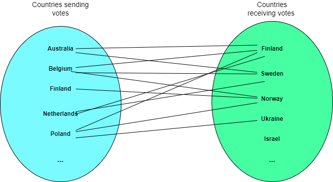
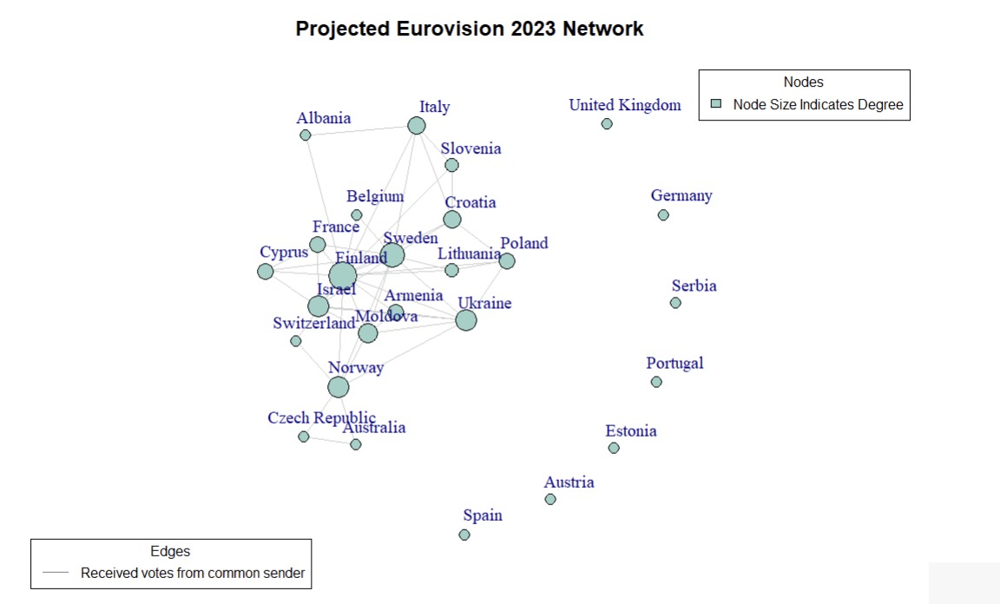
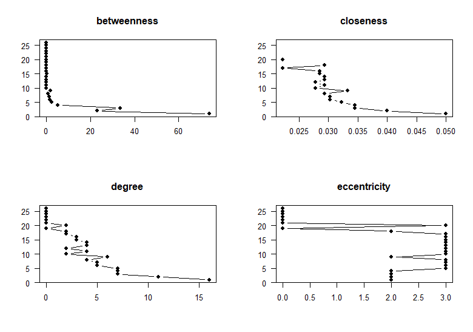
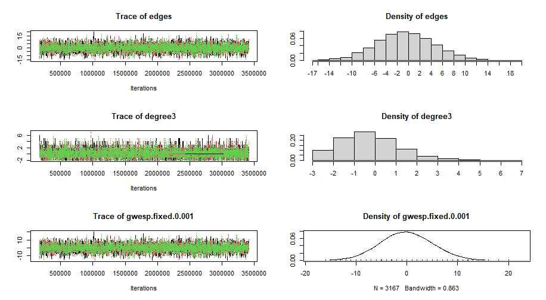
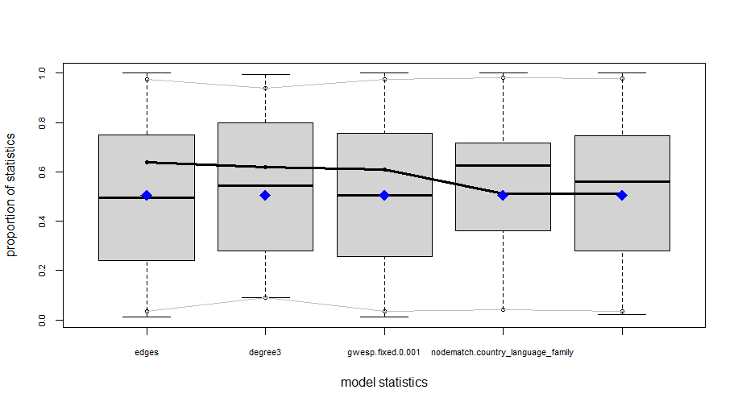
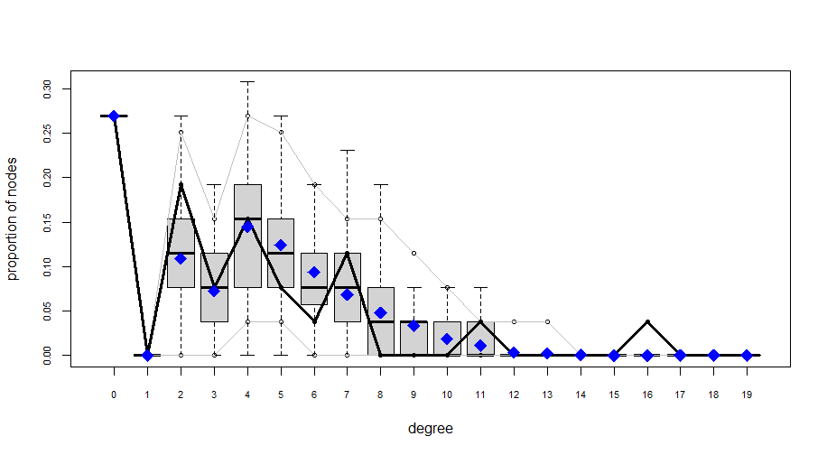
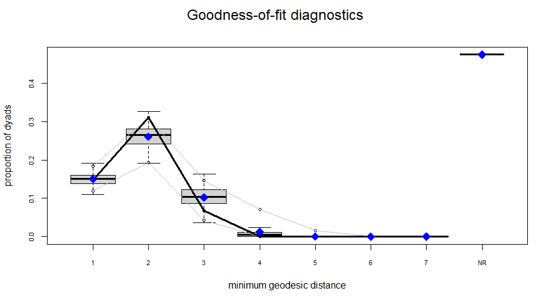
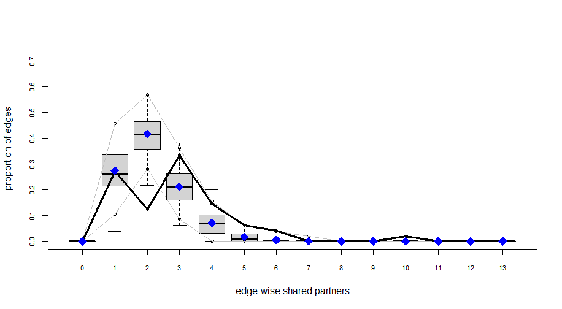
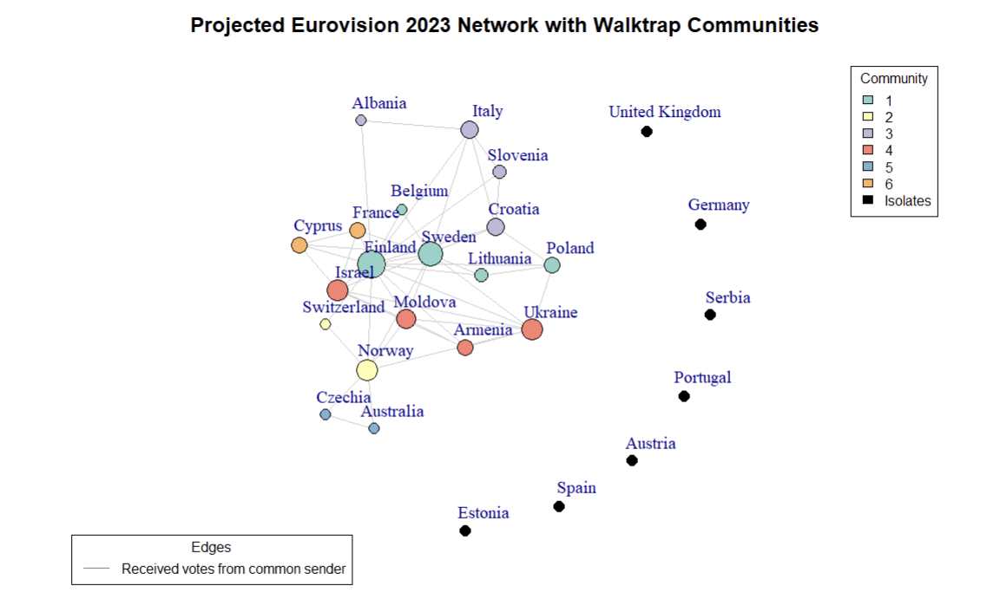

```{r setup, include = FALSE}
library("papaja")
r_refs("r-references.bib")
```

```{r analysis-preferences, include = FALSE}
# Seed for random number generation
set.seed(42)
knitr::opts_chunk$set(cache.extra = knitr::rand_seed)
```

## Executive Summary

This study investigates community formation and voting patterns among
Eurovision countries using 2023 public vote data. The research follows
up on the idea that voting patterns occur between similarities between
countries. Analysis reveals a notable presence of small communities
within the Eurovision context, underscoring the intricate social
dynamics at play. Contrary to initial hypotheses, factors such as
country government systems and language families do not significantly
influence voting behavior. This suggests that while smaller communities
prevail, traditional socio-political and linguistic ties have limited
impact on public voting patterns. These findings prompt a reevaluation
of the determinants driving voting behaviors in the Eurovision song
contest, emphasizing the need for nuanced exploration of socio-cultural
connections and emergent communities within the framework of this global
event.

## Introduction

Eurovision, the renowned singing competition featuring countries from
across Europe, surpasses a mere display of vocal prowess. It operates as
a lively puzzle where diverse nations strive for victory, transcending
the notion of merely singing exceptionally well. The intrigue lies in
how countries strategically cast their votes, underscoring the necessity
to comprehend Eurovision's intricate voting network. Beyond the song
itself, Eurovision resembles a clandestine voting club influenced by
factors such as geographical proximity and shared history. Thus, success
in Eurovision extends beyond hitting high notes; it involves the unseen
friendships backstage. However, the question arises: Is it fair for the
prestigious glass microphone trophy to be awarded solely based on a
country's friendships? Does the existence of an international singing
contest lose its significance if the winner is predetermined by
alliances with other countries?

These international friendships, while adding a unique flavor to
Eurovision, introduce potential biases in the voting process, raising
questions about the overall fairness of the competition. Substantial
research has already delved into the examination of biases within the
Eurovision song contest through the analysis of past editions.

### Literature Review

Previous studies analysed the basis of these friendship patterns within
the Eurovision voting network. Research has already been conducted in
the field of social networks regarding voting patterns which as a
consequence leads to creating communities within the Eurovision
participants. Research has already been conducted using the Eurovision
cast from 2005 where he analysed the friendship network using techniques
previously developed for valued networks , which combine
network-analysis methods with statistical methods
[@dekker2007eurovision] , [@dekker2005]. Dekker's analysis of the votes
cast in the 2005 Eurovision Song Contest revealed that friendship
between countries is largely determined by geographical proximity, with
a visible five-bloc structure: Western, Eastern, Nordic, Balkan, and
Eastern Mediterranean.

D'Angelo et al. (2019) introduced the concept of modeling latent spaces
in multidimensional networks, specifically focusing on its application
to the exchange of votes within the Eurovision Song Contest. The model
was put into practice to analyze voting patterns in the Eurovision Song
Contest, spanning from 1998 to 2015. This analysis incorporated cultural
and geographical factors. It was discovered that the only significant
factor in explaining observed voting patterns was the presence of a
shared border between the two countries. Interestingly, the similarities
among participants during the 1998-2015 period only partially correlated
with their respective geographical locations.

Ginsburgh et al. (2022) suggested that the findings from the 2021
edition indicated a higher tendency for reciprocity among geographically
proximate nations. Notable examples included Greece and Cyprus, Bulgaria
and Moldova, Moldova and Russia, Russia and Azerbaijan, and Bulgaria and
Greece. The analysis also explored the concept of group reciprocity,
uncovering voting clusters among countries. An illustrative instance was
the Scandinavian nations, including Denmark, Finland, Iceland, Norway,
and Sweden, with noteworthy outcomes in the context of the 2021
competition.

Research has demonstrated that the shared characteristics of voting
groups play a significant role in shaping the outcomes of voting
systems, revealing insights into the potential biases that may arise.
Nevertheless, delving further into similar characteristics through
additional research has the potential to bring even greater value to our
understanding of this topic. Exploring these common features more
comprehensively can contribute to a deeper examination of voting bias
and its implications.

Research has consistently demonstrated the significant role of language
in shaping Eurovision voting behavior [@ginsburgh2008eurovision]. A
compelling illustration of this influence is the close bond between
Greece and Cyprus. Greek, the primary language in Greece, is spoken by
roughly 75% of the Cypriot population, contributing to the evident
affinity between the two nations in the Eurovision Song Contest. This
example underscores how shared language serves as a pivotal factor
influencing voting patterns, reflecting a broader trend across
Eurovision-participating countries. Delving further into the influence
of language, particularly shared language families, adds depth to the
discussion on voting patterns in Eurovision, enriching our understanding
of the role linguistic ties play in this dynamic competition.

Countries with the same or similar government system seem to have
stronger bonds with each other than the ones that have different
internal political structures. Rodriguez et al. (2014) indicated that
autocracies exhibiting institutional characteristics resembling those of
democracies --- such as enhanced leader accountability, restricted
policy flexibility, and increased transparency---are more likely to
succeed in cooperation. Consequently, these autocracies are more prone
to collaborate not only with each other but also with democracies. The
expectation is that single-party and military regimes hold an advantage
in international cooperation when contrasted with personalist systems.
The study examines the cooperative behavior between pairs of states
through analysis of the 10 Million International Dyadic Events data from
1990 to 2004 [@king2003automated]. The findings are consistent with the
core theoretical argument. Single-party regimes, posited to have an
advantage in international cooperation, are, indeed, more likely to be
actively sought as partners.\`

### Research questions and hypothesis

Building on the understanding that shared characteristics shape voting
outcomes, this research delves into the influence of language family,
and political systems on the Eurovision voting network. Before analyzing
the impact of these factors, an examination of the voting network will
establish whether distinct voting communities exist. This preliminary
analysis will provide the basis for later investigating whether language
family and the political system significantly contribute to the
formation of these voting groups. This leads to the following set of
research questions that will be answered:

-   ***RQ1: To what extent do countries form communities in the
    Eurovision song contest?***

-   ***RQ2: What are the primary drivers behind public voting patterns
    among Eurovision countries?***

The aforementioned research questions lead to the following hypothesis
regarding the first research question:

-   H0: There is not a significant number of communities within the
    Eurovision competition.

-   H1: There is a significant number of communities within the
    Eurovision competition.

The aforementioned research questions lead to the following hypothesis
regarding second research question:

-   H0: The government system and language family do not have an
    influence on how countries distribute their votes during the
    Eurovision competition

-   H1: The government system has an effect on how countries distribute
    their votes during the Eurovision competition,

-   H2: Language family has an effect on how countries distribute their
    votes during Eurovision competition.

Answering the aforementioned research questions and testing hypotheses
is going to help us understand to a certain extent whether there are
voting patterns inside Eurovision as well as to understand what may
cause those phenomena.

To address the first research question and validate the first
hypothesis, a Conditional Uniform Graph (CUG) test will be conducted,
detecting communities within the network by generating a null model and
randomizing it while preserving structural properties. For the second
research question and to validate the second hypothesis, an Exponential
Random Graph Model (ERGM) will be utilized, providing a robust and
flexible approach to assess the impact of exogenous attributes on
network structure, considering complex dependencies and configurations
within the network.

For this research, only the latest edition of Eurovision (2023) is
analyzed. Also, the main interest is whether the forming of these
communities led to a biased winner and therefore, one would suggest that
the Eurovision voting system should be revised. Moreover, only the votes
cast by the public will be used in forming the voting network. This is
because public votes are better predictors of the finishing position
[@ginsburgh2023eurovision].

In the subsequent sections of the report, an explanation of the datasets
used will be provided, outlining the steps involved in cleaning and
preparing the data prior to any analysis. Furthermore, a descriptive
analysis will be presented to enhance comprehension of the data.
Additionally, the rationale for selecting the Conditional Uniform Graph
(CUG) and Exponential Random Graph Model (ERGM) methods for addressing
the research questions and testing hypotheses will be discussed.

## Methodology

### Dataset

For this project, the data has been collected from several sources.
Using multiple origins of data allowed us to enrich the dataset and run
a more comprehensive analysis.

On the Eurovision website [@Eurovisionworld] the data is presented in a
table which by switching the tab on the top of the page can be easily
filtered by jury or public votes. Data is presented in the form of a
matrix where columns are created by countries that were giving the
points and rows are represented by countries that were receiving scores.
Each entry of the matrix is represented by the number of points that
were given and received. This data was produced 13th of May 2023 when
the final of the tournament took place.

It is crucial to understand that this is a bipartite network. This type
of network consists of nodes divided into two separate groups, with
connections existing exclusively between nodes from different groups,
not within the same group. This structure is often represented
graphically as a two-mode network, showcasing relationships between
distinct sets of entities. In this case, one set of nodes are the
countries that distribute votes and the other countries are the ones
that receive votes.

Due to the complexity of bipartite networks and the time constraint for
this project, the network has been projected. Projecting a network
involves simplifying its structure by focusing on specific connections
or relationships within the network. For this project, the network has
been projected using a common sender. That means that an edge is created
between 2 countries (receivers) when they both receive votes from the
same country (sender). For each sender only the top 3 votes were taken
into consideration because the top 3 votes in Eurovision hold the
highest significance due to their impact on the final results; these
votes often heavily influence scoring and determine the leading
positions, shaping the overall outcome and perceptions of success in the
competition. The process of projecting the network, is presented in
[Appendix A].

To enrich the data information about each country's language family and
country political system has been collected ([@Compendium,
@jakubmariancom], [@Wikipedia_2023_Government]). This data was manually
inserted into CSV files.

As a result, the whole dataset contains 2 CSV files. The first CSV file
contains information about the countries (which in this paper are also
going to be referred to as nodes) such as country name, country language
family, and country political system. This file is used to enrich the
information about nodes. The second file is the incidence matrix where
the votes distributed by the public communities are presented and used
to create a network object. It is crucial to mention that the
`Rest of the world` was omitted from senders column due to the inability
to assign specific government systems or language families to this
heterogeneous category.

The selection of node attributes has been done after doing the
literature review and discovering research gaps. That led to the
following attributes for the nodes:

-   country_name

-   country_language_family

-   country_government_system

### Potential bias in the datasets

All data is publicly available online in English thus anyone with access
to the internet can view it. Language barrier can be a limitation,
however, nowadays a lot of online dictionaries are available to
translate the websites immediately. Thus no major biases in the data
have been identified.

## Exploration of the dataset

Data exploration in social network analysis is essential as it reveals
network structures, identifies influential nodes, and uncovers patterns
of interaction. This initial step is pivotal for understanding,
interpreting, and drawing meaningful insights from the complex web of
relationships within social networks.

### Descriptive analysis

Firstly descriptive analysis needs to be conducted to establish a
foundational understanding crucial for informed decision-making and
insightful conclusions.

From the descriptive analysis for both networks, it can be observed that
there are 37 vertices and 112 edges. Density is 0.14 which is low and
the networks can be considered sparse with few connections between nodes
in total. Reciprocity is equal to 1 which shows that likelihood or
tendency for two individuals to mutually form connections or
relationships is actually 100%. Transitivity is equal to 0.4480519 which
shows that there is a relatively low likelihood of the "a friend of my
friend is my friend" phenomenon. The mean distance is Infinite since
there are 7 isolates in this network and it is not possible to reach
every node in this network. Because this network is undirected it is not
possible to obtain all possible triad census. The ones present in the
network are 003, 102, 201, and 300. It does not indicate a diverse and
comprehensive set of structural configurations among triplets of nodes
in both networks.

-   [Appendix B]shows the plot of the network of Public votes
    Eurovision.
-   [Appendix C] shows the plot centralities of Public votes Eurovision.
    An explanation of the centralities terms can be found in [Appendix
    J].
-   [Appendix D](#appendix-d) shows descriptive statistics of the
    network of Public Votes Eurovision

That significant amount of isolates in that network might lead to
statistical instability or convergence issues in the model estimation
process. ERGMs, especially when including dyadic-dependent terms, the
model might struggle with isolated nodes due to their lack of
connectivity.

### Data analysis (Research Rationale)

It is important to understand why the CUG test and ERGM model are
suitable for this data and how they are going to help to answer the
research question as well as what are the potential alternatives for
them. As has been already described in [Research Questions and
Hypothesis] section to answer the first research question, the CUG test
is going to be conducted, and to answer the second research question
ERGM model is going to be developed.

#### Conditional Uniform Graph using walktrap community detection

To answer first research question and to test the first hypothesis it
will be checked to what extent small communities are formed within the
Eurovision contest. Firstly, it needs to be decided which algorithm is
suitable for detecting the communities within this network
characteristics. Since both networks are relatively small and they are
characterized by short-range interactions which can be observed by
looking at the mean distance, walktrap community detection has been
chosen as the suitable algorithm to detect communities within the
networks.

The walktrap community detection algorithm was introduced in the paper
by Pascal Pons and Matthieu Latapy in 2005 [@newman2006finding]. The
paper was presented at the International Workshop on Computer Science
and its Applications (CSA) in 2005. The primary focus of the algorithm
is on detecting community structures in networks by leveraging the
concept of random walks. It aims to identify groups of nodes that are
likely to be part of the same community based on the tendency of nodes
to be frequently visited together in random walks.

There are also other possible algorithms to detect communities such as
fast-greedy, Girvan-Newman, and Louvain. However, after analyzing the
network structure, it has been decided that the walktrap community suits
the best data characteristics.

##### Understanding CUG test

The Conditional Uniform Graph (CUG) facilitates community detection in a
network by initially creating a null model and randomizing the network
while maintaining specific structural characteristics, such as node
degrees. Subsequently, it employs a detection algorithm to pinpoint
potential clusters of nodes in the original network. Within this test,
it is possible to specify which algorithm is going to be used to detect
communities and as it has been described above, a walktrap community
detection algorithm is going to be applied.

#### Exponential Random Graph Models

Establishing a linkage between the focus of Exponential Random Graph
Models (ERGMs) and the research question is pivotal. Aligning ERGMs with
the research questions helps measure important network traits, checking
if predicted network structures support or contradict hypotheses. Based
on the available data the second research question analyzes what are the
drivers that influence voting patterns during the Eurovision contest.
This model allows dyadic dependent as well as dyadic interdependent
terms which allow capturing the structure of the network. ERGMs provide
a basis for statistical inference, allowing assessing the significance
of the effects of government systems and language families on the
network.

## Results

### Conditional Uniform Graph Test

As it has been already described in the section above, a CUG test has
been conducted to answer the first research question and test the first
hypothesis.

In this CUG test, the walktrap algorithm detects communities in
networks. The walktrap algorithm is used in the test to assess the
significance. The communities detected by the walktrap algorithm are
shown in a graph of the network [[Appendix L]]. This graph displays the
communities as certain colors, where nodes within the same community
will have the same color. It is visible that some communities consist of
5, 4 or 2 countries. Another notable characteristic is that certain
nodes have a high degree while some have a much lower degree. This is
also true for the communities themselves. Some communities consist of
countries with relatively low degrees, for example the community of
Italy. Other communities consist of mainly high-degree nodes, for
example the community of Ukraine. The previously discussed
characteristics imply that certain countries have more connections with
countries from different communities.

Notably, the Univariate Conditional Uniform Graph (CUG) Test can assess
whether these detected communities are significant. The histogram and
the CUG Test results [[Appendix I]] relate directly to the research
question and hypotheses as follows:

CUG tests allow to test the hypotheses for the first research question.
The CUG test can explain whether features of interest of the observed
graph, have a high likelihood of being the result of chance. The results
of CUG tests can therefore aid in the process of finding p-values, that
can explain whether the results are statistically significant. Thus,
using the CUG test enables us to reject or not reject the null
hypothesis.

In the results, the histogram [[Appendix I]] visualizes the distribution
of the network with the following conditioning: "Dyad.census" and 5000
repetitions. The bars represent how many communities were present in
randomly generated networks during the CUG Test. The plot shows that the
number of communities ranges from 2 to 11, with 4 and 5 being the most
frequent. The red line does not intersect one of the bars representing
randomly generated communities. This indicates that a randomly generated
network, is unlikely to have an equal or greater number of communities
than the observed network. The results show that for randomly generated
networks with similar attributes, the probability of such a simulated
network having an equal or greater number of communities than the
observed value is approximately 0. Therefore it can be concluded that
the communities are significant.

This indicates that the likelihood of encountering the current amount of
observed communities is low when the null hypothesis would be true. The
p-value is 0, which implicates a rejection of the null hypothesis.
Considering the first research question (To what extent do countries
formulate small communities between each other in the Eurovision
competition?), the findings indicate that in the Eurovision competition
countries do form communities.

From the network graph [[Appendix L]] it can be observed that there is a
network of 26 different countries in the Eurovision competition
consisting of 13 different communities when individual isolates are also
considered to be single "communities". However, when the condition for a
community is that it has to contain at least 2 nodes, then the network
has 6 communities according to the walktrap algorithm. In this research
the network contains isolates, therefore the amount of observed
communities that will be used in this research is 13.

### ERGM

To answer the second research question, ERGM model has been designed.
Exponential Random Graph Models (ERGMs) employ network statistics as
predictors, encapsulating structural properties as well as dyadic
dependent terms. The observed network structure serves as the outcome
variable, enabling estimation of tie probability based on these features
to model network formation or evolution in social network analysis.

After conducting a literature review this paper would like to
investigate which and to what extent exogenous terms influence public
voting patterns during the Eurovision contest. However, to fully
understand it, it is also crucial to recognize the network charasterics,
therefore, after analyzing the network structure the model takes into
consideration also dyadic dependent terms. Dyadic-dependent terms
account for dependencies between specific pairs of nodes, capturing
interactions beyond what simpler terms, like edge or triangle counts,
can represent. Including these terms improves the model's ability to
accurately depict and predict the formation of ties between individual
nodes based on their specific relationships, enhancing the model's
explanatory power for real-world network dynamics.

All the aforementioned matters were taken into consideration and led to
the following model to be run and analyzed. Please find the model in the
[Appendix E].

The following covariate and dyadic-dependent terms have been inserted:

-   `nodematch("country_language_family")` term assesses homophily among
    countries based on their respective language family

-   `nodematch("country_government_system")` term assesses homophily
    among countries based on their respective government systems

-   `degree(3)` term allows the model to capture and reproduce the
    observed distribution of node degrees equal to 3 while accounting
    for the tendency of nodes to have more or fewer connections than
    expected by chance.

-   `gwesp(decay = 0.001, fixed = TRUE)` This term accounts for how
    likely nodes are to create connections based on the number of mutual
    connections they share. The decay parameter in `gwesp()` determines
    the rate at which the contribution of shared partners decreases as
    their distance from the focal node increases. A higher decay value
    results in a quicker decrease in the contribution of shared partners
    as they are farther away.

The model described above performed relatively well on the MCMC
diagnostics. Trace for every term inside the model has a shape that is
similar to a "fuzzy caterpillar" which means that the chain mix well
[Appendix F]. Given this understanding, the next step involves examining
the Goodness of Fit in order to see whether the model-generated networks
replicate the features and patterns present in the observed network.
Looking at the graphs in [Appendix G] it can be observed that according
to all of them model captured most the essential structural
characteristics of the Eurovision network. Only the edge-wise shared
partner graph has a small deficiency when it comes to capturing the
proportion of edges that have 2 edge-wise shared partners.

With the aforementioned knowledge, it is possible to look at the models
statistics. After running the model the following coefficients have been
obtained. which are written down in the Probability ratio table.

Looking at them it can be observed that edges, degree3 as well as
nodematch.country_government_system have negative estimates and the rest
have positive ones. However, the standard error is extraordinarily high
for edges and gwesp.fixed.0.001 which could indicate that the model is
unstable.

To check how much these variables influence the network, it is necessary
to calculate odds ratios. To do that, coefficients have to be
exponentiated.

|                                         | Estimate   | Prob  | Std. Error | Pval  |
|---------------|---------------|---------------|---------------|---------------|
| **edges**                               | -892.56703 | 0.000 | 364.289    | 0.014 |
| **degree3**                             | -0.68790   | 0.334 | 0.768      | 0.370 |
| **gwesp.fixed.0.001**                   | 889.61735  | NaN   | 363.747    | 0.014 |
| **nodematch.country_government_system** | -0.08231   | 0.480 | 0.606      | 0.892 |
| **nodematch.country_language_family**   | 0.46119    | 0.613 | 0.331      | 0.163 |

: Probability ratio table

It can be seen in the table above that there are 2 terms with a very low
p-value, namely `gwesp.fixed.0001` and `edges,` and could be considered
significant.

`edges` term considers the tendency for nodes to form edges

`gwesp` term considers the tendency for nodes to form edges based on the
number of shared partners they have. In this specific model, the decay
is set to 0.0001 at the fixed rate.

These results can be analyzed with the following formula: *An increase
of 1 X1 in increases the log odds with θ1 (log odds) and it makes the
odds of the effect taking place exp(01) times larger.*

Nevertheless, the standard errors for these terms are extraordinarily
high which does not allow to read these results with statistical
confidence.

Applying this formula to our ERGM model results can be transformed to
the sentence as follows: - An increase of 1 in the number of edges
increases the log odds(-892.6) with and it makes the odds of the effect
taking place exp(-892.6) times larger.

-   An increase of 1 in geometrically weighted shared partners increases
    the log odds with 889.6 (log odds) and it makes the odds of the
    effect taking place exp(889.6) times larger.

Moreover, a probability of 0.000 for `edges` term suggests that there is
very low high chance in making new edges. A probability of 0.000
suggests that, according to the ERGM being used, the observed number of
edges in the network is very unlikely to occur based on the model's
specification. This low probability indicates that the odds of forming
an edge in this network are very low.

When it comes to gwesp() term probability of infinity suggests that the
observed network structure, which includes this tendency for nodes to
share partners, is always true under the ERGM framework. This
probability indicates that the network's pattern of shared connections
among nodes, as described by the `gwesp()` term, is more likely than
alternative patterns or structures within the ERGM framework.

Except these this specific dyadic dependent term, the rest of the
variables have a very high p-value and therefore, their coefficients are
not going to be considered and exponentiated.

With the given model formula the following hypothesis could be verified:

-   H2: Government system has an effect on how countries distribute
    their votes during the Eurovision competition

-   H3: Language family has an effect on how countries distribute their
    votes during the Eurovision competition

As it has been stated none of the structural terms was found to be
significant for the network and, therefore, the null hypothesis (H0: The
government system and language family do not have an influence on how
countries distribute their votes during the Eurovision competition) for
the second research hypothesis can not be rejected.

## Conclusion

This study aimed to study the Eurovision context in terms of social
network analysis based on the official results from 2023. Literature
review in the field of previous Eurovision editions suggested that
distributing votes was biased in the past years
[@D_Angelo_Murphy_Alfò_2019], [@ginsburgh2008eurovision]. Diving more
into the literature and discovering research gaps led to the work of
Rodriguez et al. (2014) and as a consequence, this paper included in the
analysis to what extent the similarities in the political system could
be a cause of voting bias. That led to 2 research questions which were
stated at the beginning of the study and the CUG test and ERGM model
were run to answer them as well as to test the stated hypothesis.

### Discussion

The outcomes of the CUG test suggest that, according to the walktrap
algorithm, there are 13 observed communities. This quantity of
communities is significant, which leads to a rejection of the null
hypothesis. However, it is important to acknowledge that in this case, a
higher number of communities corresponds to a higher number of isolates.
In this research, the isolates represent countries that did not receive
top 3 votes from other countries. This simplification of the voting
process, might have an impact on the outcome due to oversimplification.

The approach of solely including top 3 votes, could therefore have
influenced the number of communities detected by the walktrap algorithm.
Thus it could also have influenced the statistically significant
outcome. It is plausible that when considering more votes than top 3,
the results might be different, leading to larger and fewer communities,
which could result in the CUG test being nonsignificant.

Language family and government system turned out to be not statistically
significant and as a consequence, the second research question can be
answered that these factors do not have an effect how people vote during
the Eurovision context. Moreover, standard errors for `edges` and
`gwesp()` term make reading the results not trustworthy since they may
indicate that the model is unstable. More experiments must be run using
either different projections or running the analysis on a bipartite
network.

### Future work

As it has been described in the [ERGM] section MCMC diagnostics and GOF
look relatively good but undoubtedly the model can be further improved
to understand the structure of the network even better. Several other
models have been run during this research. Some of them scored either
very low or did not converge in the given time frame. The list of all
the models that have been run together with model specifications are
presented in [APPENDIX K].

In this research project, the network has been projected based on the
common sender. Nevertheless, projecting the network differently could
reveal more information. For instance, projecting the network while
retaining the points, one could connect two countries if they share a
common receiver or sender, and the weight of the edge is the sum or
average of the points exchanged between them across multiple events.

Projecting the network always leads to losing certain information from
the network. In this particular research, information about how many
points were given to the country was lost. As a consequence, running the
analysis on the bipartite network could reveal very interesting results
since more information will remain inside the network.

\newpage

# Appendix A



The graph in the figure above presents just the sample of the data in
what way the network has been projected. Three dots on the bottom of
each set represent that there are more countries in each set.

From this sample of data the following edges have been formed:

\- Finland - Sweden (both countries received votes from Australia,
Belgium, Netherlands)

\- Finland - Norway (both countries received votes from Poland, Belgium,
Netherlands)

\- Sweden - Norway (both countries received votes from Belgium)

\- Norway - Ukraine (both countries received votes from Poland)

\- Finland - Ukraine (both countries received votes from Poland)

# Appendix B



# Appendix C



# Appendix D {#appendix-d}

``` r
## Eurovision public 

## $number of vertices
## [1] 26
## $number_of_edges
## [1] 48
## density 
## [1] 0.14769
## reciprocity
## [1] 1
## transitivity
## [1] 0.4480519
## mean_distance
## [1] Inf
## number_of_isolates
## [1] "Estonia"        "Austria"       
## [3] "Portugal"       "Serbia"        
## [5] "Germany"        "United Kingdom"
## [7] "Spain"   
## dyad_census
## Mutual  Null
##      7   562
## triad_census
##  003 012 102 021D 021U 021C 111D 111U 030T 030C 201 120D 120U 120C 210 300 
## 1710   0 674    0    0    0    0    0    0   0  170    0    0    0   0  46
```

# Appendix E

``` r
### ERGM model
baseline_model_0.5 <- ergm::ergm(distribution_network ~ edges + 
                                   degree(3) + 
                                   gwesp(decay = 0.001, fixed=TRUE) +
                                   nodematch("country_language_family") +
                                   nodematch("country_government_system"),
                                   control = ergm::control.ergm(MCMC.burnin = 10000,
                                                              MCMC.samplesize = 40000,
                                                              seed = 223451,
                                                              MCMLE.maxit = 5,
                                                              parallel = 4,
                                                              parallel.type = "PSOCK"))

(s5 <- summary(baseline_model_0.5))
```

# Appendix F

::: {style="display: flex;"}
{width="876"}
{width="873"}
:::

# Appendix G

::: {style="display: grid; grid-template-columns: repeat(2, 1fr); grid-gap: 20px;"}



{width="877"}
{width="877"}
:::

# Appendix H

``` r
## CUG test for detecting communities
walktrap <- function(x, directed = FALSE) {
  x <- snafun::fix_cug_input(x, directed = directed)
  snafun::extract_comm_walktrap(x) |> length() 
}
distribution_coms <- sna::cug.test(distribution_network, FUN = walktrap, mode = "graph",
                                   diag = FALSE, cmode = "dyad.census", reps = 5000)
```

# Appendix I

::: {style="display: flex;"}
 
:::

# Appendix J

***Betweenness centrality*** of *i* is the proportion of all shortest
paths in the network that pass through *i*. It shows which nodes have
information access advantage and which are important to the network's
efficiency. It also shows the relative stress on nodes. Mathematically,
it is defined as follows:

$B(x) = \sum_{s \neq x \neq t} \frac{\sigma_{st}(x)}{\sigma_{st}}$

***Closeness*** measures how much effort it takes to reach all other
nodes in the network. Sum the distances from *i* to all other vertices,
this is it's fairness. Then, the sum is inverted. Mathematically is
defined as follows:

$C(x) = \frac{1}{\sum_{y} d(x, y)}$ where *d(v, i)* equal to the path
length between *i* and *v*.

***Degree*** measures a node's extraversion/outgoingness ("out-degree"),
popularity ("in-degree"), or involvement ("total degree").

In-Degree}(v) = Number of incoming edges to node v

Out-Degree(v) = Number of outgoing edges from node v

Total Degree(v) = In-Degree}(v) + Out-Degree}(v)

***Eccentricity*** measures the maximum distance or shortest path length
from a specific node to any other node in the network. In other words,
it quantifies how far a node is, on average, from all other nodes in the
network. Mathematically, it is defined as follows:

-   $E(x) = \max_{y} d(x, y)$ where *E(X)* represents the eccentricity
    of node *x*, and *d(x,y)* is the shortest path distance between
    nodes *x* and *y*.

# Appendix K

| Term/Model                             | Model1 | Model2                                                                                                             | Model3                      | Model4                                                                                                                                                                                                                                                                                                                                                                                                         |
|---------------|---------------|---------------|---------------|---------------|
| edges                                  | X      | X                                                                                                                  | X                           | X                                                                                                                                                                                                                                                                                                                                                                                                              |
| kstar(2)                               |        |                                                                                                                    |                             | X                                                                                                                                                                                                                                                                                                                                                                                                              |
| degree(2)                              |        |                                                                                                                    | X                           | X                                                                                                                                                                                                                                                                                                                                                                                                              |
| degree(3)                              |        | X                                                                                                                  | X                           | X                                                                                                                                                                                                                                                                                                                                                                                                              |
| isolates                               |        |                                                                                                                    | X                           | X                                                                                                                                                                                                                                                                                                                                                                                                              |
| gwesp(decay, fixed)                    |        | X (0.001, True)                                                                                                    | X (0.001, True)             | X (0.001, True)                                                                                                                                                                                                                                                                                                                                                                                                |
| gwdsp(decay, fixed)                    |        |                                                                                                                    |                             | X (0.001, True)                                                                                                                                                                                                                                                                                                                                                                                                |
| gwdegree(decay, fixed)                 |        |                                                                                                                    |                             | X                                                                                                                                                                                                                                                                                                                                                                                                              |
| nodematch("country_language_family")   | X      | X                                                                                                                  | X                           | X                                                                                                                                                                                                                                                                                                                                                                                                              |
| nodematch("country_government_system") | X      | X                                                                                                                  | X                           | X                                                                                                                                                                                                                                                                                                                                                                                                              |
| AIC                                    | 276    | 270.5                                                                                                              | \-                          | \-                                                                                                                                                                                                                                                                                                                                                                                                             |
| BIC                                    | 287.4  | 289.4                                                                                                              | \-                          | \-                                                                                                                                                                                                                                                                                                                                                                                                             |
| Converged                              | Yes    | Yes                                                                                                                | No                          | No                                                                                                                                                                                                                                                                                                                                                                                                             |
| Issue If Not Converged                 | \-     | \-                                                                                                                 | Not converged after 6 hours | Model statistics 'isolates' are not varying. This may indicate that the observed data occupies an extreme point in the sample space or that the estimation has reached a dead-end configuration. Model statistics 'nodematch.country_language_family' are linear combinations of some set of preceding statistics at the current stage of the estimation. This may indicate that the model is nonidentifiable. |
| Additional Information                 |        | Estimates and Std. Error values are high. Adjusting the decay parameter does not result in more reliable outcomes. |                             |                                                                                                                                                                                                                                                                                                                                                                                                                |

\newpage

| Term/Model                             | Model5                                                                                                                                                                                           | Model6                                                                                                                                                                                           | Model7                                                                                                                                                                                                                                                                                                                                                                                                                  | Model8                    |
|---------------|---------------|---------------|---------------|---------------|
| edges                                  | X                                                                                                                                                                                                | X                                                                                                                                                                                                | X                                                                                                                                                                                                                                                                                                                                                                                                                       |                           |
| kstar(2)                               |                                                                                                                                                                                                  |                                                                                                                                                                                                  |                                                                                                                                                                                                                                                                                                                                                                                                                         | X                         |
| degree(2)                              |                                                                                                                                                                                                  |                                                                                                                                                                                                  | X                                                                                                                                                                                                                                                                                                                                                                                                                       |                           |
| degree(3)                              | X                                                                                                                                                                                                | X                                                                                                                                                                                                | X                                                                                                                                                                                                                                                                                                                                                                                                                       | X                         |
| isolates                               | X                                                                                                                                                                                                | X                                                                                                                                                                                                | X                                                                                                                                                                                                                                                                                                                                                                                                                       |                           |
| gwesp(decay, fixed)                    | X (0.001, True)                                                                                                                                                                                  | X (0.001, True)                                                                                                                                                                                  | X (0.001, True)                                                                                                                                                                                                                                                                                                                                                                                                         | X (0.001, True)           |
| gwdsp(decay, fixed)                    |                                                                                                                                                                                                  | X (0.001, True)                                                                                                                                                                                  |                                                                                                                                                                                                                                                                                                                                                                                                                         |                           |
| gwdegree(decay, fixed)                 |                                                                                                                                                                                                  |                                                                                                                                                                                                  |                                                                                                                                                                                                                                                                                                                                                                                                                         | X                         |
| nodematch("country_language_family")   | X                                                                                                                                                                                                | X                                                                                                                                                                                                | X                                                                                                                                                                                                                                                                                                                                                                                                                       |                           |
| nodematch("country_government_system") | X                                                                                                                                                                                                | X                                                                                                                                                                                                |                                                                                                                                                                                                                                                                                                                                                                                                                         |                           |
| AIC                                    | \-                                                                                                                                                                                               | \-                                                                                                                                                                                               | \-                                                                                                                                                                                                                                                                                                                                                                                                                      | 328.6                     |
| BIC                                    | \-                                                                                                                                                                                               | \-                                                                                                                                                                                               | \-                                                                                                                                                                                                                                                                                                                                                                                                                      | 347.5                     |
| Converged                              | No                                                                                                                                                                                               | No                                                                                                                                                                                               | No                                                                                                                                                                                                                                                                                                                                                                                                                      | Yes                       |
| Issue If Not Converged                 | Model statistics 'isolates' are not varying. This may indicate that the observed data occupies an extreme point in the sample space or that the estimation has reached a dead-end configuration. | Model statistics 'isolates' are not varying. This may indicate that the observed data occupies an extreme point in the sample space or that the estimation has reached a dead-end configuration. | Model statistics 'isolates' are not varying. This may indicate that the observed data occupies an extreme point in the sample space or that the estimation has reached a dead-end configuration. Warning: Model statistics 'nodematch.country_language_family' are linear combinations of some set of preceding statistics at the current stage of the estimation. This may indicate that the model is nonidentifiable. |                           |
| Additional Information                 |                                                                                                                                                                                                  |                                                                                                                                                                                                  |                                                                                                                                                                                                                                                                                                                                                                                                                         | GOF plots do not fit well |

\newpage

# Appendix L



\newpage

# References
