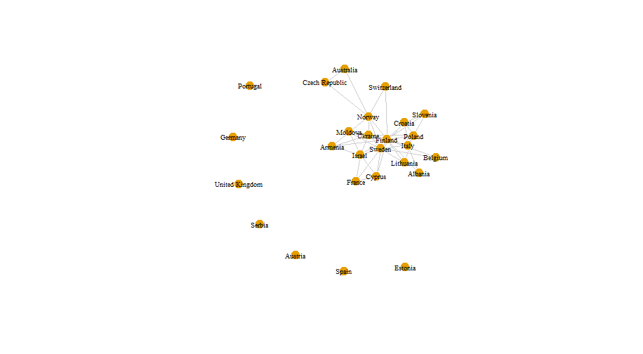
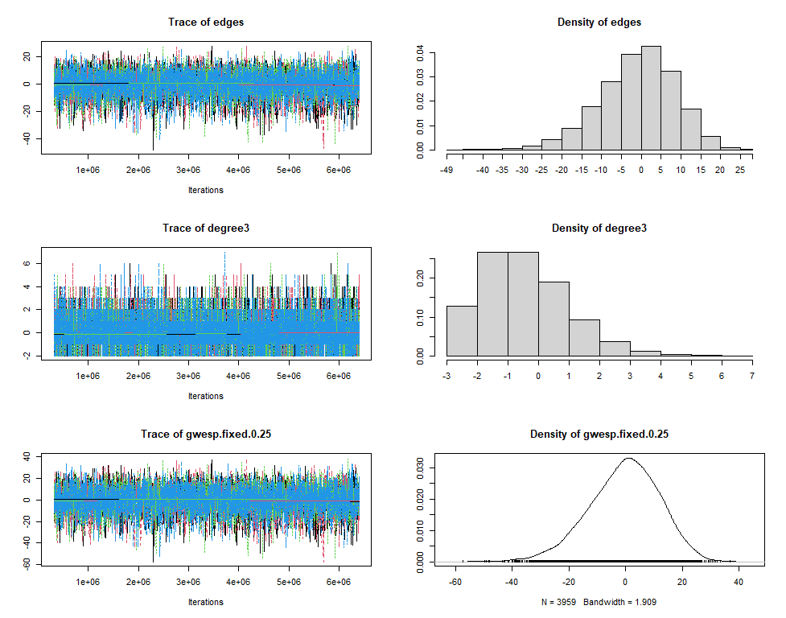
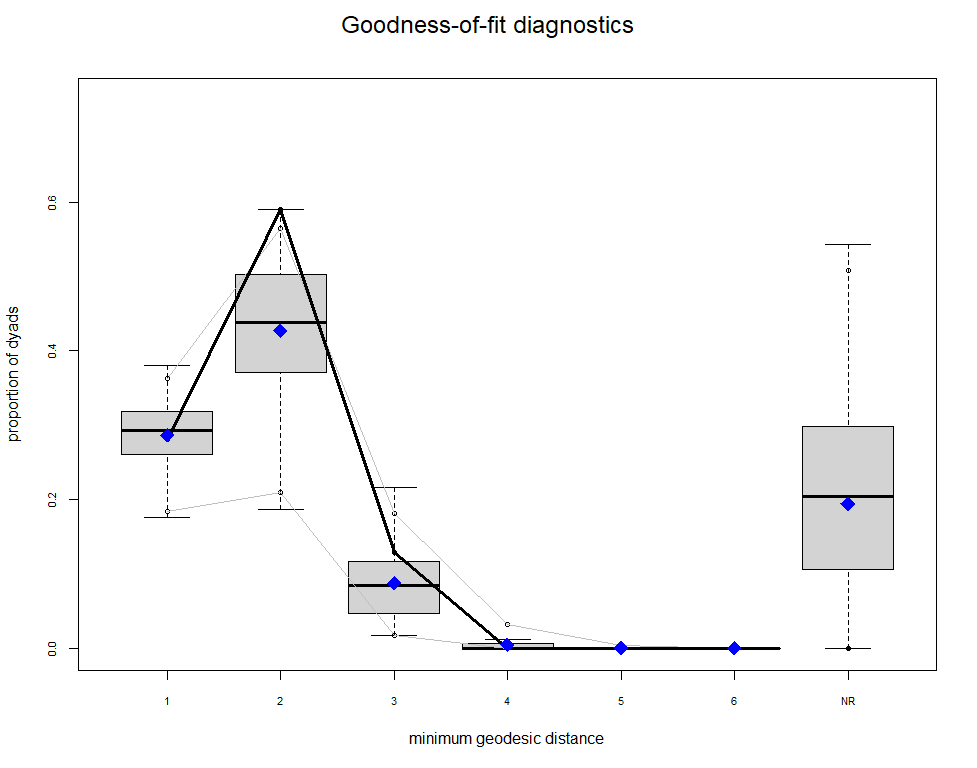
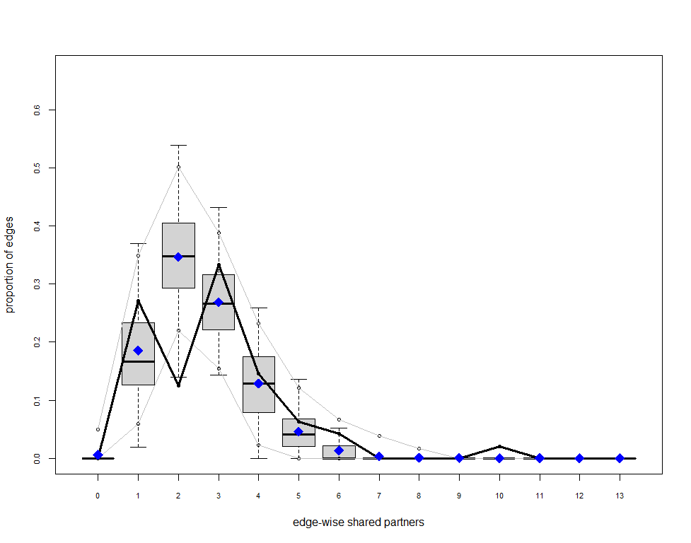

```{r setup, include = FALSE}
library(f"papaja")
r_refs("r-references.bib")
```

```{r analysis-preferences, include = FALSE}
# Seed for random number generation
set.seed(42)
knitr::opts_chunk$set(cache.extra = knitr::rand_seed)
```

## Executive Summary

Still in progress

## Introduction

Eurovision, the big singing contest with countries from all over Europe,
goes beyond simply showcasing the best singers. It's like a lively
puzzle where diverse nations aim for victory, and winning is more than
just singing exceptionally well. The interesting part is how countries
vote for their friends, emphasizing the need to understand Eurovision's
voting network. It's not just about the song itself; it's akin to a
secret voting club based on factors like being neighbors or sharing a
history. So, in Eurovision, success is not just about hitting the high
notes; it is also about the friendships behind the scenes. The
competition becomes a mix of music and an international friendship
dance. The victory's melody is not just in the lyrics but also in the
subtle connections woven behind the scenes, transforming the competition
into a symphony of intertwined relationships.

These international friendships, while adding a unique flavor to
Eurovision, introduce potential biases in the voting process, raising
questions about the overall fairness of the competition. Substantial
research has already delved into the examination of biases within the
Eurovision song contest through the analysis of past editions.

Previous studies analysed the basis of these friendship patterns within
the Eurovison voting network. Research has already been conducted in the
field of social networks regarding voting patterns which as a
consequence leads to creating communities within the Eurovision
participants. [@dekker2007eurovision] has already conducted the research
using the Eurovision cast from 2005 where he analysed the friendship
network using techniques previously developed for valued networks
[@dekker2005], which combine network-analysis methods with statistical
methods. Dekker's analysis on the votes cast in the 2005 Eurovision Song
Contest revealed that friendship between countries is largely determined
by geographical proximity, with a visible five-bloc structure: Western,
Eastern, Nordic, Balkan, and Eastern Mediterranean.

In 2019, [@D_Angelo_Murphy_Alfò_2019] introduced the concept of modeling
latent spaces in multidimensional networks, specifically focusing on its
application to the exchange of votes within the Eurovision Song Contest.
The model was put into practice to analyze voting patterns in the
Eurovision Song Contest, spanning from 1998 to 2015. This analysis
incorporated cultural and geographical factors. It was discovered that
the only significant factor in explaining observed voting patterns was
the presence of a shared border between two countries. Interestingly,
the similarities among participants during the 1998-2015 period only
partially correlated with their respective geographical locations.

In 2022 [@Ginsburgh_Moreno-Ternero_2022] suggested that the findings
from the 2021 edition indicated a higher tendency for reciprocity among
geographically proximate nations. Notable examples included Greece and
Cyprus, Bulgaria and Moldova, Moldova and Russia, Russia and Azerbaijan,
and Bulgaria and Greece. The analysis also explored the concept of group
reciprocity, uncovering voting clusters among countries. An illustrative
instance was the Scandinavian nations, including Denmark, Finland,
Iceland, Norway, and Sweden, with noteworthy outcomes in the context of
the 2021 competition.

Research has demonstrated that the shared characteristics of voting
groups play a significant role in shaping the outcomes of voting
systems, revealing insights into the potential biases that may arise.
Nevertheless, delving further into similar characteristics through
additional research has the potential to bring even greater value to our
understanding of this topic. Exploring these common features more
comprehensively can contribute to a deeper examination of voting bias
and its implications.

Research has consistently demonstrated the significant role of language
in shaping Eurovision voting behavior [@ginsburgh2008eurovision]. A
compelling illustration of this influence is the close bond between
Greece and Cyprus. Greek, the primary language in Greece, is spoken by
roughly 75% of the Cypriot population, contributing to the evident
affinity between the two nations in the Eurovision Song Contest. This
example underscores how shared language serves as a pivotal factor
influencing voting patterns, reflecting a broader trend across
Eurovision-participating countries. Delving further into the influence
of language, particularly shared language families, adds depth to the
discussion on voting patterns in Eurovision, enriching our understanding
of the role linguistic ties play in this dynamic competition.

Countries with the same or similar government system seem to have
stronger bonds with each other than the ones that have different
internal political structures. Research done by [@Mattes_Rodríguez_2014]
indicates that autocracies exhibiting institutional characteristics
resembling those of democracies --- such as enhanced leader
accountability, restricted policy flexibility, and increased
transparency---are more likely to succeed in cooperation. Consequently,
these autocracies are more prone to collaborate not only with each other
but also with democracies. The expectation is that single-party and
military regimes hold an advantage in international cooperation when
contrasted with personalist systems. The study examines the cooperative
behavior between pairs of states through analysis of the 10 Million
International Dyadic Events data from 1990 to 2004 [@king2003automated].
The findings are consistent with the core theoretical argument.
Single-party regimes, posited to have an advantage in international
cooperation, are, indeed, more likely to be actively sought as
partners.\`

Building on the understanding that shared characteristics shape voting
outcomes, this research delves into the influence of language family and
political systems on the Eurovision voting network. Before analyzing the
impact of these factors, an examination of the voting network will
establish whether distinct voting communities exist. This preliminary
analysis will provide the basis for later investigating whether language
family and the political system significantly contribute to the
formation of these voting groups. This leads to the following set of
research questions that will be answered:

-   ***RQ1: To what extent do countries form communities in the
    Eurovision song contest?***

-   ***RQ2: How do language family and the government system influence
    the distribution of votes within communities of countries during the
    Eurovision song contest***

The aforementioned research questions lead to the following hypothesis
regarding first research question:

-   H0: There is not a significant number of communities within the
    Eurovision competition.

-   H1: There is a significant number of communities within the
    Eurovision competition.

The aforementioned research questions lead to the following hypothesis
regarding second research question:

-   H0: The governmental system and language family do not have an
    influence on how countries distribute their votes during the
    Eurovision competition

-   H1: The governmental system has an effect on how countries
    distribute their votes during the Eurovision competition,

-   H2: Language family has an effect on how countries distribute their
    votes during Eurovision competition.

Answering the aforementioned research questions and testing hypotheses
is going to help us understand to a certain extent whether there are
voting patterns inside Eurovision as well as to understand what may
cause those phenomena.

To answer the first research question and validate the first hypothesis,
a Conditional Uniform Graph (CUG) test will be conducted. The CUG allows
detecting communities within a network firstly by generating a null
model and randomizing the network while preserving certain structural
properties, such as node degrees. Then, it applies a detection algorithm
to identify potential groups of nodes in the original network. How
exactly the CUG model is going to be used and which community detection
algorithm is chosen in this project is described in the [Conditional
Uniform Graph using walktrap community detection] section.

To answer the second research question and to validate the second
hypothesis, there is going to be run an Exponential Random Graph Model
(ERGM). It offers a robust and flexible approach to examine the effects
of exogenous attributes on network structure while considering the
complex dependencies and configurations within the network itself.

For this research, only the latest edition of Eurovision (2023) is
analyzed. Also, the main interest is whether the forming of these
communities led to a biased winner and therefore would suggest that the
Eurovision voting system should be revised. Moreover, only the votes
cast by the public will be used in forming the voting network. This is
because public votes are better predictors of the finishing position
accoring to [@ginsburgh2023eurovision].

In the subsequent sections of the report, an explanation of the datasets
used will be provided, outlining the steps involved in cleaning and
preparing the data prior to any analysis. Furthermore, a descriptive
analysis will be presented to enhance comprehension of the data.
Additionally, the rationale for selecting the Conditional Uniform Graph
(CUG) and Exponential Random Graph Model (ERGM) methods for addressing
the research questions and testing hypotheses will be discussed.

## Methodology

### Dataset

For this project, the data has been collected from several sources.
Using multiple origins of data allowed us to enrich the dataset and run
a more comprehensive analysis.

On the Eurovision website [@Eurovisionworld] the data is presented in a
table which by switching the tab on the top of the page can be easily
filtered by Jury or Public votes. Data is presented in a matrix where
columns are created by countries that were giving the points and rows
are represented by countries that were receiving scores. Each entry of
the matrix is represented by the number of points that were given and
received. This data was produced 13th of May 2023 when the final of the
tournament took place.

It is crucial to understand that this is a bipartite network. This type
of network consists of nodes divided into two separate groups, with
connections existing exclusively between nodes from different groups,
not within the same group. This structure is often represented
graphically as a two-mode network, showcasing relationships between
distinct sets of entities. In this case, one set of nodes are the
countries that distribute votes and the other countries are the ones
that receive votes.

Due to compl,exity of bipartite networks and the time constraint for
this project, the network has been projected. Projecting a network
involves simplifying its structure by focusing on specific connections
or relationships within the network. In this specific example the
network has been projected using common sender. That means that an edge
is created between 2 countries (receivers) when they both receive votes
from the same country (sender). For each country (sender) only the top 3
votes were taken into consideration because the top 3 votes in
Eurovision hold the highest significance due to their impact on the
final results; these votes often heavily influence scoring and determine
the leading positions, shaping the overall outcome and perceptions of
success in the competition.

To enrich the data information about each country's language family
[@Compendium, @jakubmariancom], country population [@Worldometer], and
country political system [@Wikipedia_2023_Government] have been
collected. This data was manually inserted into CSV files.

As a result, the whole dataset contains 2 CSV files. The first CSV file
contains information about the countries (which in this paper are also
going to be referred to as nodes) such as country name, country language
family, and country political system. This file is used to enrich the
information about nodes. The second file is the incidence matrix where
the votes distributed by the public communities is presented and used to
create a network object.

The selection of node attributes has been done after doing the
literature review and discovering research gaps. That led to have the
following attributes for the nodes:

-   country_name

-   country_language_family

-   country_government_system

### Potential bias in the datasets

All data is publicly available online in English thus anyone with access
to the internet can view it. Language barrier can be a limitation,
however, nowadays a lot of online dictionaries are available to
translate the websites immediately. Thus no major biases in the data
have been identified.

## Exploration of the dataset

Data exploration in social network analysis is essential as it reveals
network structures, identifies influential nodes, and uncovers patterns
of interaction. This initial step is pivotal for understanding,
interpreting, and drawing meaningful insights from the complex web of
relationships within social networks.

### Descriptive analysis

Firstly descriptive analysis needs to be conducted to establish a
foundational understanding crucial for informed decision-making and
insightful conclusions.

From the descriptive analysis for both networks, it can be observed that
there are 37 vertices and 112 edges. Density is 0.14 which is really low
and the networks can be considered sparse with few connections between
nodes in total. Reciprocity is equal to 1 which shows that likelihood or
tendency for two individuals to mutually form connections or
relationships is actually 100%. Transitivity is equal to 0.4480519 which
shows that there is relatively low likelihood of "a friend of my friend
is my friend" phenomenon. The mean distance is Infinite since there are
7 isolates in this network and it is not possible to reach every node in
this network. Because this network is undirected it is not possible to
obtain all possible triad census present in the network 003, 102, 201
and 300. It does not indicate a diverse and comprehensive set of
structural configurations among triplets of nodes in both networks.

-   [Appendix A] shows the plot of the network of Public votes
    Eurovision.
-   [Appendix B] shows the plot centralities of Public votes Eurovision.
    An explanation of the centralities terms can be found in [Appendix
    G].
-   [Appendix C] shows descriptive statistics of the network of Public
    Votes Eurovision

That significant amount of isolates in that network might lead to
statistical instability or convergence issues in the model estimation
process. ERGMs, especially when including dyadic-depend terms, the model
might struggle with isolated nodes due to their lack of connectivity.
Therefore, before running the CUG test and ERGM model, it has been
decided to remove isolates. Removing isolates might lead to a loss of
information, nevertheless, in this particular projection of the network,
these nodes represent the countries that have not received any top 3
votes, consequently having a minor impact on the top positions. Plots,
descriptive statistics, and plot centralities can be seen in the
[Appendix D](#appendix-d), [Appendix E] and [Appendix F].

### Data analysis (Research Rationale)

It is important to understand why the CUG test and ERGM model are
suitable for this data and how they are going to help to answer the
research question as well as what are the potential alternatives for
them. Removing isolates led to a change in the original data but as it
has been described in the previous section, the network remained its
most important information and allowed to have data more suitable for
running tests and models which as a consequence leads to the higher
statistical stability. As has been already described in [Research
questions and hypothesis] section to answer the first research question,
the CUG test is going to be conducted, and to answer the second research
question ERGM model is going to be developed.

#### Conditional Uniform Graph using walktrap community detection

To answer first research question and to test the first hypothesis it
will be checked to what extent small communities are formed within the
Eurovision contest. Firstly, it needs to be decided which algorithm is
suitable for detecting the communities within this network
characteristics. Since both networks are relatively small and they are
characterized by short-range interactions which can be observed by
looking at the mean distance, walktrap community detection has been
chosen as the suitable algorithm to detect communities within the
networks.

The walktrap community detection algorithm was introduced in the paper
by Pascal Pons and Matthieu Latapy in 2005 [@newman2006finding]. The
paper was presented at the International Workshop on Computer Science
and its Applications (CSA) in 2005. The primary focus of the algorithm
is on detecting community structures in networks by leveraging the
concept of random walks. It aims to identify groups of nodes that are
likely to be part of the same community based on the tendency of nodes
to be frequently visited together in random walks.

There are also other possible algorithms to detect communities such as
fast-greedy, Girvan-Newman, and Louvain. However, after analyzing the
network structure, it has been decided that the walktrap community suits
the best data characteristics.

##### Understanding CUG test

The Conditional Uniform Graph (CUG) facilitates community detection in a
network by initially creating a null model and randomizing the network
while maintaining specific structural characteristics, such as node
degrees. Subsequently, it employs a detection algorithm to pinpoint
potential clusters of nodes in the original network. Within this test,
it is possible to specify which algorithm is going to be used to detect
communities and as it has been described above walktrap community
detection algorithm is going to be applied.

#### Exponential Random Graph Models

Establishing a linkage between the focus of Exponential Random Graph
Models (ERGMs) and the research query is pivotal. Aligning ERGMs with
the research questions helps measure important network traits, checking
if predicted network structures support or contradict hypotheses. Based
on the available data the second research question analyzes to what
extent language family or governmental political system influence voting
patterns during the Eurovision contest. These are both exogeneous terms
and their effect can be measured by ERGM models. This model allows
dyadic dependent as well as dyadic interdependent terms which allow
capturing the structure of the network. ERGMs provide a basis for
statistical inference, allowing assessing the significance of the
effects of governmental systems and language families on the network.

## Results

### Conditional Uniform Graph Test

As it has been already described in the section above, a CUG test has
been conducted to answer the first research question and test the first
hypothesis. The code for the CUG test can be found below:

``` r
## CUG test for detecting communities
walktrap <- function(x, directed = FALSE) {
  x <- snafun::fix_cug_input(x, directed = directed)
  snafun::extract_comm_walktrap(x) |> length() 
}
distribution_coms <- sna::cug.test(distribution_network, FUN = walktrap, mode = "graph",
                                   diag = FALSE, cmode = "dyad.census", reps = 5000)
```

As shown above, the walktrap algorithm detects communities in networks.
This walktrap algorithm is used in the CUG test to assess the
significance. The communities detected by the walktrap algorithm are
shown in a graph of the network [[ ](#appendix-d)]. This graph displays
the communities as certain colors, where nodes within the same community
will have the same color. It is visible that some communities consist of
5, 4 or 2 countries. Another notable characteristic is that certain
nodes have a high degree while some have a much lower degree. This is
also true for the communities themselves. Some communities consist of
countries with relatively low degrees, for example the community of
Italy. Other communities consist of mainly high-degree nodes, for
example the community of Ukraine. The previously discussed
characteristics imply that certain countries have more connections with
countries from different communities.

Notably, the Univariate Conditional Uniform Graph (CUG) Test can assess
whether these detected communities are significant. The histogram and
the CUG Test results [[Appendix I]] relate directly to the research
question and hypotheses as follows:

CUG tests allow to test the hypotheses for the first research question.
The CUG test can explain whether features of interest of the observed
graph, have a high likelihood of being the result of chance. The results
of CUG tests can therefore aid in the process of finding p-values, that
can explain whether the results are statistically significant. Thus,
using the CUG test enables us to reject or not reject the null
hypothesis.

In the results, the histogram [[Appendix I]] visualizes the distribution
of the network with the following conditioning: "Dyad.census" and 5000
repetitions. It can be observed that there is a network of 19 different
countries in the Eurovision competition consisting of 6 communities. The
red line in the plot dsplays the observed amount of communities in the
network.

The bars represent how many communities were present in randomly
generated networks during the CUG Test. The plot shows that the number
of communities ranges from 2 to 8, with 3 and 4 being the most frequent.
The red line intersects the bar representing 6 communities. This
indicates that a randomly generated network, can have the same amount of
communities as the observed network. Therefore it is necessary to look
at the p-value. The results show that for randomly generated networks
with similar attributes, the probability of such a simulated network
having an equal or greater number of communities than the observed value
is approximately 0.08. For a significance level of 0.05, it can be
concluded that the communities are not significant.

This indicates that the likelihood of encountering the current amount of
observed communities is not low enough when the null hypothesis would be
true. Therefore the null hypothesis cannot be rejected.

Considering the first research question (To what extent do countries
formulate small communities between each other in the Eurovision
competition?), the findings indicate that in the Eurovision competition,
the communities that were detected by the walktrap algorithm were not
significant. Consequently, implications drawn from the detected
communities are uncertain and thus not applicable. However, it must be
noted that isolates were removed in the process, as the exclusion of
isolates influences the community distribution and thus the
significance.

### ERGM

To answer the second research question, ERGM model has been designed.
Exponential Random Graph Models (ERGMs) employ network statistics as
predictors, encapsulating structural properties as well as dyadic
dependent terms. The observed network structure serves as the outcome
variable, enabling estimation of tie probability based on these features
to model network formation or evolution in social network analysis.

After conducting literature review this paper would like to investigate
which and to what extent exogenous terms influence public voting
patterns during the Eurovision contest. However, to fully understand it,
it is also crucial to understand the network charasterics as well,
therefore, after analyzing the network structure the model takes into
consideration also dyadic dependent terms. Dyadic-dependent terms
account for dependencies between specific pairs of nodes, capturing
interactions beyond what simpler terms, like edge or triangle counts,
can represent. Including these terms improves the model's ability to
accurately depict and predict the formation of ties between individual
nodes based on their specific relationships, enhancing the model's
explanatory power for real-world network dynamics.

All the aforementioned matters were taken into consideration and led to
the following model to be run and analyzed.

``` r
### ERGM model
baseline_model_0.5 <- ergm::ergm(distribution_network_without_isolates ~ edges + 
                                   degree(3) + 
                                   gwesp(decay = 0.25, fixed=TRUE) +
                                   nodematch("country_language_family") +
                                   nodematch("country_government_system"),
                                   control = ergm::control.ergm(MCMC.burnin = 10000,
                                                              MCMC.samplesize = 40000,
                                                              seed = 223451,
                                                              MCMLE.maxit = 5,
                                                              parallel = 4,
                                                              parallel.type = "PSOCK"))

(s5 <- summary(baseline_model_0.5))
```

The following dyadic dependent terms have been inserted:

-   `nodematch("country_language_family")` term checks for homophily
    between the countries based on their language family

-   `nodematch("country_government_system")` term checks for homophily
    between the countries based on their country government system

-   `degree(3)` term allows the model to capture and reproduce the
    observed distribution of node degrees equal to 3 while accounting
    for the propensity of nodes to have more or fewer connections than
    expected by chance.

-   `gwesp(decay = 0.25, fixed = TRUE)` This term accounts for how
    likely nodes are to create connections based on the quantity of
    mutual connections they share. . The decay parameter in gwesp()
    determines the rate at which the contribution of shared partners
    decreases as their distance from the focal node increases. A higher
    decay value results in a quicker decrease in the contribution of
    shared partners as they are farther away.

The model described above performed relatively well on the MCMC
diagnostics. Trace for every term inside the model has a shape that is
similar to "fuzzy caterpillar" which means that chain mix well
[[Appendix D](#appendix-d)]. Knowing that it is possible to move to
analyzing Goodness of Fit to see whether the model-generated networks
replicate the features and patterns present in the observed network.
Looking at the graphs in the [Appendix F] it can be observed that
according to all of them model captured most the essential structural
characteristics of the Eurovision network. Only edge-wise shared partner
graph has a small deficiency when it comes to capturing the proportion
of edges which have 2 edge-wise shared partners.

With the aferomentioned knowledge it is possible look at the models
statistics. After running the model the following coefficients have been
obtained:

|                                         | Estimate | Std. Error |
|-----------------------------------------|----------|------------|
| **edges**                               | -5.015   | 1.087      |
| **degree3**                             | -0.009   | 0.771      |
| **gwesp.fixed.0.25**                    | 2.741    | 0.834      |
| **nodematch.country_language_family**   | -0.132   | 0.601      |
| **nodematch.country_government_system** | 0.391    | 0.291      |

: Coefficient table

Looking at them it can be observed that edges, degree3 as well as
nodematch.country_language_family have negative estimates and the rest
have positive ones. However, the standard error is extraordinary high
for edges and gwesp.fixed.0.001 which could indicate that model is
unstable.

To check how much these variables influence network, it is necessary to
calculate odds ratios. To do that, coefficients have to be
exponentiated.

|                                         | Estimate | Prob  | Std. Error | Pval  |
|---------------|---------------|---------------|---------------|---------------|
| **edges**                               | -5.015   | 0.007 | 1.087      | 0.000 |
| **degree3**                             | -0.009   | 0.497 | 0.771      | 0.991 |
| **gwesp.fixed.0.25**                    | 2.741    | 0.939 | 0.834      | 0.001 |
| **nodematch.country_language_family**   | -0.132   | 0.467 | 0.601      | 0.826 |
| **nodematch.country_government_system** | 0.391    | 0.597 | 0.291      | 0.179 |

: Probability ratio table

It can be seen in the table above that there are 2 terms with a very low
p-value, namely `gwesp.fixed.025` and `edges` and could be considered
significant.

`edges` term considers the tendency for nodes to form edges

`gwesp` term considers the tendency for nodes to form edges based on the
number of shared partners they have. In this specific model, the decay
is set to 0.25 at the fixed rate.

These results can be analyzed with the following formula: *An increase
of 1 X1 in increases the log odds with θ1 (log odds) and it makes the
odds of the effect taking place exp(01) times larger.*

Applying this formula to our ERGM model results can be transformed to
the sentence as follows: - An increase of 1 in the number of edges
increases the log odds(-5.015) with and it makes the odds of the effect
taking place exp(-5.015) times larger.

-   An increase of 1 in geometrically weighted shared partners increases
    the log odds with 2.731 (log odds) and it makes the odds of the
    effect taking place exp(2.741) times larger.

Moreover, a probability of 0.007 for `edges` term suggests that there is
ver low high chance in making new edges. A probability of 0.007 suggests
that, according to the ERGM being used, the observed number of edges in
the network is very unlikely to occur based on the model's
specification. This low probability indicates that the odds of forming
an edge in this network are very low.

When it comes to gwesp() term probability of 0.939 suggests that the
observed network structure, which includes this tendency for nodes to
share partners, is highly probable under the ERGM framework. This
probability indicates that the network's pattern of shared connections
among nodes, as described by the `gwesp()` term, is more likely than
alternative patterns or structures within the ERGM framework.

Except these this specific dyadic dependent term, the rest of the
variables have a very high p-value and therefore, its coefficients are
not going to be considered and exponentiated.

With the given model formula the following hypothesis could be verified:

-   H2: Governmental system has an effect on how countries distribute
    their votes during the Eurovision competition

-   H3: Language family has an effect on how countries distribute their
    votes during the Eurovision competition

As it has been stated none of the structural terms was found to be
significant for the network and, therefore, the null hypothesis (H0: The
governmental system and language family do not have an influence on how
countries distribute their votes during the Eurovision competition) for
the second research hypothesis can not be rejected.

## Conclusion <yet in progress>

This study aimed to study the Eurovision context in terms of social
network analysis based on the official results from 2023. 2 research
questions were stated in the beginning of the study, CUG test and ERGM
model have been run to answer them and test the stated hypothesis.

We did not prove that language family and governmenr system have a a
significant effect but Xavier mentioned a very good point. He pointed
one block where they specifically did not vote on Norway becaiuse they
were directly competing.

### Future work

-   There is a possibility to improve ERGM MCMCs and GOF. One of that
    potential option could be dyadic dependent term kstar(). There is an
    assumption to that some countries are more popular than the others
    (have more edges connected to them). The model with that tern has
    been run but unfortunately the model did not converge during the
    night. Due to time constraint of this project there was no attempt
    in making this model converge.
-   Try maybe different projections

\newpage

# Appendix A



# Appendix B


# Appendix C

``` r
## Eurovision public 

## $number of vertices
## [1] 26
## $number_of_edges
## [1] 48
## density 
## [1] 0.14769
## reciprocity
## [1] 1
## transitivity
## [1] 0.4480519
## mean_distance
## [1] Inf
## number_of_isolates
## [1] "Estonia"        "Austria"       
## [3] "Portugal"       "Serbia"        
## [5] "Germany"        "United Kingdom"
## [7] "Spain"   
## dyad_census
## Mutual  Null
##      7   562
## triad_census
##  003 012 102 021D 021U 021C 111D 111U 030T 030C 201 120D 120U 120C 210 300 
## 1710   0 674    0    0    0    0    0    0   0  170    0    0    0   0  46
```

# Appendix D {#appendix-d}


# Appendix E


# Appendix F

``` r
## Eurovision public without Isolates

## $number of vertices
## [1] 19
## $number_of_edges
## [1] 48
## density 
## [1] 0.2807018
## reciprocity
## [1] 1
## transitivity
## [1] 0.4480519
## mean_distance
## [1] 2.74269
## number_of_isolates
## character(0)  
## dyad_census
## Mutual  Null
##      48   123
## triad_census
## 003 012 102 021D 021U 021C 111D 111U 030T 030C 201 120D 120U 120C 210 300
## 415   0 338    0    0    0    0    0    0    0 170    0    0    0   0  46
```

# Appendix G

::: {style="display: flex;"}
{width="876"}
{width="873"}
:::

# Appendix H

::: {style="display: grid; grid-template-columns: repeat(2, 1fr); grid-gap: 20px;"}
](images/ProjectedNetworkWithoutIsolatesGOFModelStatistics.png)

{width="877"}
{width="877"}
:::

# Appendix I

::: {style="display: flex;"}
 
:::

# Appendix J

***Betweenness centrality*** of *i* is the proportion of all shortest
paths in the network that pass through *i*. It shows which nodes have
information access advantage and which are important to the network's
efficiency. It also shows the relative stress on nodes. Mathematically,
it is defined as follows:

$B(x) = \sum_{s \neq x \neq t} \frac{\sigma_{st}(x)}{\sigma_{st}}$

***Closeness*** measures how much effort it takes to reach all other
nodes in the network. Sum the distances from *i* to all other vertices,
this is it's fairness. Then, the sum is inverted. Mathematically is
defined as follows:

$C(x) = \frac{1}{\sum_{y} d(x, y)}$ where *d(v, i)* equal to the path
length between *i* and *v*.

***Degree*** measures a node's extraversion/outgoingness ("out-degree"),
popularity ("in-degree"), or involvement ("total degree").

In-Degree}(v) = Number of incoming edges to node v

Out-Degree(v) = Number of outgoing edges from node v

Total Degree(v) = In-Degree}(v) + Out-Degree}(v)

***Eccentricity*** measures the maximum distance or shortest path length
from a specific node to any other node in the network. In other words,
it quantifies how far a node is, on average, from all other nodes in the
network. Mathematically, it is defined as follows:

-   $E(x) = \max_{y} d(x, y)$ where *E(X)* represents the eccentricity
    of node *x*, and *d(x,y)* is the shortest path distance between
    nodes *x* and *y*.

\newpage

# References
