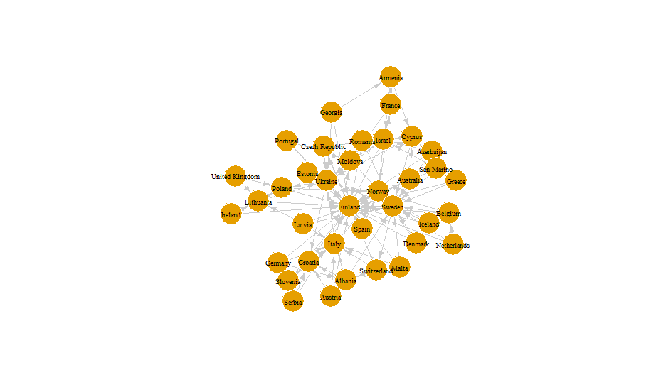
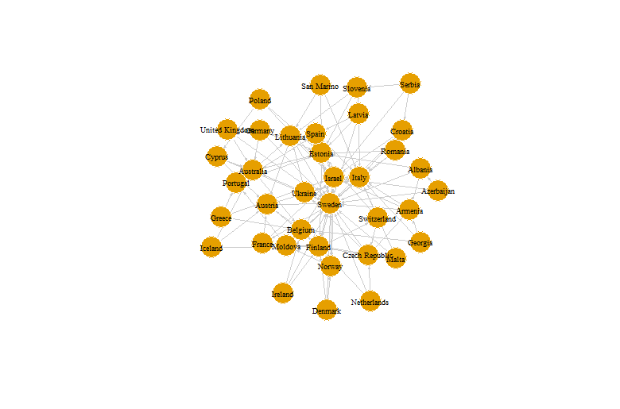

```{r setup, include = FALSE}
library("papaja")
r_refs("r-references.bib")
```

```{r analysis-preferences, include = FALSE}
# Seed for random number generation
set.seed(42)
knitr::opts_chunk$set(cache.extra = knitr::rand_seed)
```

## Executive Summary

Still in progress

## Introduction

### Concept of Eurovision

The Eurovision Song Contest, which has taken place every year since
1956, is organized by the European Broadcasting Union. It is televised
live throughout Europe and is also broadcast internationally with a
delay. The primary goal of the Eurovision Song Contest is to discover
the most beloved song in Europe. One of the most iconic champions of
this competition is Abba, the Swedish representatives in 1974, who
performed the song "Waterloo." This paper examines the votes cast in the
European song contest in 2023.

Studying social networks within the Eurovision context is of paramount
importance for various reasons. First, it provides invaluable cultural
insights, as Eurovision serves as a reflection of the diverse cultures
and values of participating countries. Additionally, examining voting
patterns illuminates the influence of political and regional alliances
on the integrity of the competition, offering potential avenues for
reform.

Furthermore, the substantial public engagement generated by Eurovision
on social media offers insights into which aspects of the contest
resonate most with the audience. Social network analysis also enables
predictive analytics, aiding contestants, broadcasters, and sponsors in
making informed decisions about the popularity of acts or songs.

Understanding fan communities on social media helps tailor strategies to
engage and mobilize passionate supporters, while assessing marketing and
promotion effectiveness through social networks aids in reaching a
broader audience. Finally, it's crucial for optimizing the digital
experience and gathering audience feedback to enhance the overall
Eurovision experience.

### Research on Social Networks in the Eurovision Context

Research has already been conducted in the field of social networks
regarding voting patterns which as a consequence leads to creating
communities within the Eurovision participants. Dekker A. (2007)
[@dekker2007eurovision] has already conducted the research using
Eurovision cast from 2005 where he analysed the friendship network using
techniques previously developed for valued networks (Dekker, 2005)
[@dekker2005], which combine network-analysis methods with statistical
methods. His analysis revealed a set of friendship blocs.

In 2019, Angelo S.D. et al. [@D_Angelo_Murphy_Alfò_2019] introduced the
concept of modeling latent spaces in multidimensional networks,
specifically focusing on its application to the exchange of votes within
the Eurovision Song Contest. The model was put into practice to analyze
voting patterns in the Eurovision Song Contest, spanning from 1998 to
2015. This analysis incorporated cultural and geographical factors. It
was discovered that the only significant factor in explaining observed
voting patterns was the presence of a shared border between two
countries. Interestingly, the similarities among participants during the
1998-2015 period only partially correlated with their respective
geographical locations.

In 2022 Ginsbrugh V et al. suggested [@Ginsburgh_Moreno-Ternero_2022]
that in the context of the 2021 edition, the findings suggest a greater
propensity for reciprocity among geographically proximate nations. For
instance, we previously highlighted the case of Greece and Cyprus, and
this pattern is also discernible in other pairs, such as Bulgaria and
Moldova, Moldova and Russia, Russia and Azerbaijan, and Bulgaria and
Greece. Furthermore, our analysis delves into the concept of group
reciprocity, wherein we investigate the presence of voting clusters
among countries A notable example comprises the Scandinavian nations,
encompassing Denmark, Finland, Iceland, Norway, and Sweden. It is worth
noting that Denmark did not progress to the final round of the
competition. Within this cluster, Finland received 13 points,
constituting approximately 20% of its total score, Iceland amassed 27
points, Norway obtained 5 points, which represented a third of its
overall score, and Sweden achieved a particularly noteworthy outcome,
garnering 25 points, equivalent to over half of its total score.

Hence, it is evident that extensive research has already been undertaken
concerning Eurovision voting patterns in the domain of social networks.
Studies take into consideration various aspects but there is a lack of
research when it comes to the newest Eurovision editions. Moreover,
there is a lack of research when it comes to analyzing the influence of
the political system of the country as well as the influence of language
family.

### Research questions and hypothesis

Analyzing the current state of the art and identifying the research gaps
led to the following research questions:

-   ***RQ1: To what extent do countries formulate small communities
    between each other in the Eurovision competition?***

-   ***RQ2: To what extent governmental system influence how the
    countries distribute their votes during the Eurovision
    competition?***

The aforementioned research questions lead to the following hypothesis
regarding first research question:

-   H0: There is not a significant number of communities within
    Eurovision competition.

-   H1: There is a significant number of communities within Eurovision
    competition.

The aforementioned research questions lead to the following hypothesis
regarding second research question:

-   H0: Governmental system and language family do not have an influence
    how countries distribute their votes Eurovision competition

-   H1: Governmental system and language family have an effect how
    countries distribute their votes during Eurovision competition

Answering the aforementioned research questions and testing hypotheses
is going to help us to understand to a certain extent whether there are
voting patterns inside Eurovision as well as to understand what may
cause those phenomena.

To answer the first research question and to validate the first
hypothesis we are going to run a Conditional Uniform Graph (CUG) test.
The CUG allows detecting communities within a network firstly by
generating a null model and randomizing the network while preserving
certain structural properties, such as node degrees. Then it applies a
detection algorithm to identify potential groups of nodes in the
original network. How excatly the CUG model is used in this project is
going to be described in the CUG model section.

To answer the second research question and to validate the second
hypothesis we are going to run Exponential Random Graph Model (ERGM)
test. It offers a robust and flexible approach to examine the effects of
exogenous attributes on network structure while considering the complex
dependencies and configurations within the network itself.

In the rest of the report, we will carefully describe the datasets that
are going to be used to conduct the research. Data cleaning and if
necessary data preprocessing are going to be run before any analysis.
Descriptive analysis is going to be performed to understand the data
better. The research rationale is going to be discussed to provide the
reasoning why CUG and ERGM have been chosen as suitable models for
answering research questions and testing hypotheses.

## Methodology

### Dataset

For this project, the data has been collected from several sources.
Using multiple origins of data allowed us to enrich the dataset and run
a more comprehensive analysis.

On the Eurovision website [@Eurovisionworld] the data is presented in a
table which by switching the tab on the top of the page can be easily
filtered by Jury or Public votes. Data is presented in a matrix where
columns are created by countries who were giving the points and rows are
represented by countries who were receiving scores. Each entry of the
matrix is represented by the number of points that were given/received.
Due to the time constraint of this project, for each country only the
top 3 votes were taken into consideration thus possible edge attributes
are represented in the set {8,10,12} which corresponds to the top 3
votes given by the country. This data was produced 13th of May 2023 when
the final of the tournament took place.

To enrich the data we also collected information about each country's
language family [the source to language family], country population
[@Worldometer], and country political system [the source to governmental
system]. This data was manually inserted into CSV files which eventually
allowed to transform it to the network object.

As a result, the whole dataset contains 3 CSV files. The first CSV file
contains information about the countries which in this paper are also
going to be referred to as nodes, population, country language family,
and country political system. This file is used to create a list of
nodes which is used to create a network object.

The second CSV file contains information about the votes of jurys from
the countries. There are 3 columns in this file sender, receiver, and
score which represent the amount of points given from the sender to
receiver. This file is used to create an edge list which is used to
create a first network object.

The third CSV file contains information about the votes from the public
from the countries. There are 3 columns in this file sender, receiver,
and score which represent the amount of points given from the sender to
receiver. This file is used to create an edge list which is used to
create a second network object.

In this paper, 2 network objects are created and analyzed. The first
network object is created using Node List which comes from the first csv
file and an edge list which represents jurys votes and is created from
the second csv file. The second network object is created using the same
Node List and an edge list which represents public votes and is created
from the third csv file.

The selection of node attributes has been done after doing the research
and discovering research gaps. That led nodes to have the following
attributes:

-   country_name
-   country_population
-   country_language_family
-   country_government_system

Furthermore, 3 CSV files allowed the creation of 2 network objects which
as a consequence allowed to perform deeper analysis and reveal potential
differences in voting patterns between jury and public.

### Potential bias in the datasets

All data is publicly available online in English thus anyone with access
to the internet can view it. Language barrier can be a limitation,
however, nowadays a lot of online dictionaries are available to
translate the websites immediately. Thus no major biases in the data
have been identified.

## Exploration of the dataset

Data exploration in social network analysis is essential as it reveals
network structures, identifies influential nodes, and uncovers patterns
of interaction. This initial step is pivotal for understanding,
interpreting, and drawing meaningful insights from the complex web of
relationships within social networks.

### Descriptive analysis \<yet in progress\>

Firstly descriptive analysis needs to be conducted to establish a
foundational understanding crucial for informed decision-making and
insightful conclusions. Since both networks show similar descriptive
statistics they are going to be both described under one paragraph. In
the paragraph below first network is considered as a network created
from votes from jury and the second one as the network created from
votes from public.

From the descriptive analysis for both networks, it can be observed that
there are 37 vertices and 112 edges. Density is 0.084 and 0.083 for the
first and second network respectively which is really low and the
networks can be considered sparse with few connections between nodes in
total. Reciprocity is equal to 0.125 and 0.053 which indicates that
12.5% of the edges in the network involve mutual connections in the
first network and 5.3% in the second network. Transitivity is equal to
0.209 and 0.208 which shows that there is very low likelihood of "a
friend of my friend is my friend" phenomenon. The mean distance in both
network is just slightly between 2.5 and 2.65 which means that on
average the shortest path is around 2.5 steps long which means that
nodes are relatively close to each other and the networks are compact.
There are no isolates present in either network. There are all types of
triad census present in the first network except *300* and the absence
of *120U* and *300* in the second one. It indicates a diverse and
comprehensive set of structural configurations among triplets of nodes
in both networks.

-   Looking at [Appendix A] we can see the plot of the network of Jury
    votes Eurovision

<!-- -->

-   Looking at [Appendix B] we can see the plot centralities of Jury
    votes Eurovision

    ***Betweenness centrality*** of i is the proportion of all shortest
    paths in the network that pass through i. It shows which nodes have
    information access advantage and are important to the network's
    efficiency. It also shows the relative stress on nodes.
    Mathematically is defined as follows:

    $B(x) = \sum_{s \neq x \neq t} \frac{\sigma_{st}(x)}{\sigma_{st}}$

    ***Closeness*** measures how much effort it takes to reach all other
    nodes in the network. Sum the distances from i to all other
    vertices, this is it's fairness. Then, invert this sum.

    Mathematically is defined as follows::
    $C(x) = \frac{1}{\sum_{y} d(x, y)}$ where d(v, i) equal to the path
    length between i and v.

    ***Degree*** measures a node's extraversion/outgoingness
    ("out-degree"), popularity ("in-degree"), or involvement ("total
    degree").

    $\text{In-Degree}(v) = \text{Number of incoming edges to node } v \\\text{Out-Degree}(v) = \text{Number of outgoing edges from node } v \\\text{Total Degree}(v) = \text{In-Degree}(v) + \text{Out-Degree}(v)$

    ***Eccentrity*** measures the maximum distance or shortest path
    length from a specific node to any other node in the network. In
    other words, it quantifies how far a node is, on average, from all
    other nodes in the network.

    Mathematically is defined as follows: $E(x) = \max_{y} d(x, y)$where
    *E(X)* represents the eccentricity of node *x*, and *d(x,y)* is the
    shortest path distance between nodes *x* and *y*.

-   Looking at [Appendix C] we can see descriptive statistics of the
    network of Jury votes Eurovision

#### Jury votes Eurovision

-   Looking at [Appendix D] we can see the plot of the network of Jury
    votes Eurovision

<!-- -->

-   Looking at [Appendix E] we can see the plot centralities of Jury
    votes Eurovision
-   Looking at [Appendix F] we can see descriptive statistics of the
    network of Jury votes Eurovision

### Data analysis (Research Rationale) \<yet in progress\>

It is important to understand why CUG and ERGM tests are suitable for
this data and how they are going to help us answer research questions.
As it has been already described [Research questions and hypothesis] to
answer the first research question, the CUG test is going to be
conducted, and to answer the second research question ERGM model is
going to be developed.

#### Conditional Uniform Graph

This can be achieved by a `sna::cugtest` function that does the graph
generation and computes the network measure. Using a Conditional Uniform
Graph is a valuable approach to assess the number of communities within
a network because it provides a rigorous and controlled framework for
community detection, helps identify meaningful structures, and allows
for statistical analysis and algorithm validation.

#### Exponential Random Graph Models

## Results

(about 2000 words)

### Model 1

still in progress

### ERGM

still in progress

## Conclusion

still in progress

\newpage

# Appendix A



# Appendix B


# Appendix C

``` r
## Eurovision public 
## $number of vertices
## [1] 37
## $number_of_edges
## [1] 112
## density 
## [1] 0.08408408
## reciprocity
## [1] 0.125
## transitivity
## [1] 0.2097902
## mean_distance
## [1] 2.50487
## number_of_isolates
## character(0)
## dyad_census
## Mutual Asymmetric Null
##      7         98  561
## triad_census
##  003  012 102 021D 021U 021C 111D 111U 030T 030C 201 120D 120U 120C 210 300
## 5026 1776 107   31  541  104  104    8   48    3   3   11    4    3   1   0
```

# Appendix D



# Appendix E


# Appendix F

``` r
## Eurovision jury 
## $number of vertices
## [1] 37
## $number_of_edges
## [1] 112
## density 
## [1] 0.08333333
## reciprocity
## [1] 0.05357143
## transitivity
## [1] 0.2084691
## mean_distance
## [1] 2.619632
## number_of_isolates
## character(0)
## dyad_census
## Mutual Asymmetric Null
##      7         105  558
## triad_census
##  003  012 102 021D 021U 021C 111D 111U 030T 030C 201 120D 120U 120C 210 300
## 4847 2070  60   43  449  184   47    6   46    3   0   11    0    3   1   0
```

\newpage

# References
