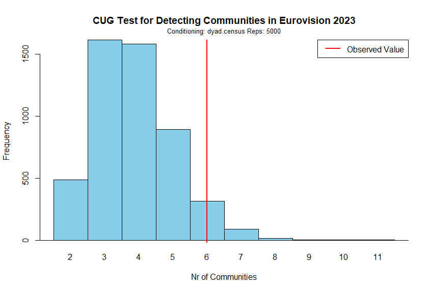

```{r setup, include = FALSE}
library("papaja")
r_refs("r-references.bib")
```

```{r analysis-preferences, include = FALSE}
# Seed for random number generation
set.seed(42)
knitr::opts_chunk$set(cache.extra = knitr::rand_seed)
```

## Executive Summary

Still in progress

## Introduction

Eurovision, the big singing contest with countries from all over, is not
just about who sings the best. It resembles a vibrant puzzle where
diverse nations vie for victory, with winning extending beyond
exceptional singing. The intriguing phenomenon of countries voting for
their friends underscores the importance of analyzing Eurovision's
voting network. It's not about the song alone; it's like a secret voting
club based on things like being neighbors or having a history together.
So, in Eurovision, it's not only about hitting the high notes but also
about who your buddies are behind the scenes. The competition becomes a
mix of music and a kind of international friendship dance.

Previous studies analysed the basis of these friendship patterns within
the Eurovison voting network. Research has already been conducted in the
field of social networks regarding voting patterns which as a
consequence leads to creating communities within the Eurovision
participants. Dekker A. (2007) [@dekker2007eurovision] has already
conducted the research using the Eurovision cast from 2005 where he
analysed the friendship network using techniques previously developed
for valued networks (Dekker, 2005) [@dekker2005], which combine
network-analysis methods with statistical methods. Dekker's analysis on
the votes cast in the 2005 Eurovision Song Contest revealed that
friendship between countries is largely determined by geographical
proximity, with a visible five-bloc structure: Western, Eastern, Nordic,
Balkan, and Eastern Mediterranean.

In 2019, Angelo S.D. et al. [@D_Angelo_Murphy_Alfò_2019] introduced the
concept of modeling latent spaces in multidimensional networks,
specifically focusing on its application to the exchange of votes within
the Eurovision Song Contest. The model was put into practice to analyze
voting patterns in the Eurovision Song Contest, spanning from 1998 to
2015. This analysis incorporated cultural and geographical factors. It
was discovered that the only significant factor in explaining observed
voting patterns was the presence of a shared border between two
countries. Interestingly, the similarities among participants during the
1998-2015 period only partially correlated with their respective
geographical locations.

In 2022, Ginsbrugh V et al. suggested [@Ginsburgh_Moreno-Ternero_2022]
that the findings from the 2021 edition indicated a higher tendency for
reciprocity among geographically proximate nations. Notable examples
included Greece and Cyprus, Bulgaria and Moldova, Moldova and Russia,
Russia and Azerbaijan, and Bulgaria and Greece. The analysis also
explored the concept of group reciprocity, uncovering voting clusters
among countries. An illustrative instance was the Scandinavian nations,
including Denmark, Finland, Iceland, Norway, and Sweden, with noteworthy
outcomes in the context of the 2021 competition.

<<<<<<< HEAD
Research has demonstrated that the shared characteristics of voting groups
play a significant role in shaping the outcomes of voting systems, revealing
insights into the potential biases that may arise. Nevertheless, delving
further into similar characteristics through additional research has the
potential to bring even greater value to our understanding of this topic.
Exploring these common features more comprehensively can contribute to a
deeper examination of voting bias and its implications.

Research has consistently demonstrated the significant role of language
in shaping Eurovision voting behavior [@ginsburgh2008eurovision]. A
compelling illustration of this influence is the close bond between
Greece and Cyprus. Greek, the primary language in Greece, is spoken
by roughly 75% of the Cypriot population, contributing to the evident
affinity between the two nations in the Eurovision Song Contest. This
example underscores how shared language serves as a pivotal factor
influencing voting patterns, reflecting a broader trend across
Eurovision-participating countries. Delving further into the
influence of language, particularly shared language families,
adds depth to the discussion on voting patterns in Eurovision, enriching
our understanding of the role linguistic ties play in this dynamic competition.
=======
Hence, it is evident that extensive research has already been undertaken
concerning Eurovision voting patterns in the domain of social networks.
Studies take into consideration various aspects but there is a lack of
research when it comes to the newest Eurovision editions. Moreover,
there is a lack of research when it comes to analyzing the influence of
the political system of the country as well as the influence of language
family.
>>>>>>> 900221d38fb9723395137d90160f745b611f4b40

Countries with the same or similar government system seem to have
stronger bonds with each other than the ones that have different
internal political structures. Research done by [@Mattes_Rodríguez_2014]
indicates that autocracies exhibiting institutional characteristics
resembling those of democracies --- such as enhanced leader
accountability, restricted policy flexibility, and increased
<<<<<<< HEAD
transparency---are more likely to succeed in cooperation. Consequently,
these autocracies are more prone to collaborate not only with each other
but also with democracies. The expectation is that single-party and
military regimes hold an advantage in international cooperation when
contrasted with personalist systems. The study examines the cooperative
behavior between pairs of states through analysis of the 10 Million
International Dyadic Events data from 1990 to 2004 [@king2003automated].
The findings are consistent with the core theoretical argument.
Single-party regimes, posited to have an advantage in international
cooperation, are, indeed, more likely to be actively sought as partners.`

to conclude, the Eurovision is not only about singing skills.
There are various reasons which influence voting patterns
and their diversity is great. After carefully studying what research has been
already done regarding Euriovision context and what yet is to be examined, this
research will focus on examining the influence of language family as well as the
government system of each country.
=======
transparency --- are more likely to succeed in cooperation.
Consequently, these autocracies are more prone to collaborate not only
with each other but also with democracies. The expectation is that
single-party and military regimes hold an advantage in international
cooperation when contrasted with personalist systems. The study examines
the cooperative behavior between pairs of states through analysis of the
10 Million International Dyadic Events data from 1990 to 2004
[@king2003automated]. The findings are consistent with the core
theoretical argument. Single-party regimes, posited to have an advantage
in international cooperation, are, indeed, more likely to be actively
sought as partners.
>>>>>>> 900221d38fb9723395137d90160f745b611f4b40

Studying social networks within the Eurovision context is of paramount
importance for various reasons. First, it provides invaluable cultural
insights, as Eurovision serves as a reflection of the diverse cultures
and values of participating countries. Additionally, examining voting
patterns illuminates the influence of political and regional alliances
on the integrity of the competition, offering potential avenues for
reform.

### Research questions and hypothesis

Analyzing the current state of the art and identifying the research gaps
led to the following research questions:

-   ***RQ1: To what extent do countries formulate small public
    communities between each other in the Eurovision competition?***

-   ***RQ2: What factors influence the distribution of votes within
    public communities during the Eurovision competition?***

The aforementioned research questions lead to the following hypothesis
regarding first research question:

-   H0: There is not a significant number of communities within the
    Eurovision competition.

-   H1: There is a significant number of communities within the
    Eurovision competition.

The aforementioned research questions lead to the following hypothesis
regarding second research question:

-   H0: The governmental system and language family do not have an
    influence on how countries distribute their votes during the
    Eurovision competition

-   H1: The governmental system has an effect on how countries
    distribute their votes during the Eurovision competition,

-   H2: Language family has an effect on how countries distribute their
    votes during Eurovision competition.

Answering the aforementioned research questions and testing hypotheses
is going to help us to understand to a certain extent whether there are
voting patterns inside Eurovision as well as to understand what may
cause those phenomena.

To answer the first research question and to validate the first
hypothesis we are going to run a Conditional Uniform Graph (CUG) test.
The CUG allows detecting communities within a network firstly by
generating a null model and randomizing the network while preserving
certain structural properties, such as node degrees. Then it applies a
detection algorithm to identify potential groups of nodes in the
original network. How exactly the CUG model is going to be used and
which community detection algorithms is chosen in this project is
described in the [Conditional Uniform Graph using walktrap community
detection] section.

To answer the second research question and to validate the second
hypothesis we are going to run Exponential Random Graph Model (ERGM)
test. It offers a robust and flexible approach to examine the effects of
exogenous attributes on network structure while considering the complex
dependencies and configurations within the network itself.

In the rest of the report, we will carefully describe the datasets that
are going to be used to conduct the research. Data cleaning and data
preprocessing are going to be run before any analysis. Descriptive
analysis is going to be performed to understand the data better. The
research rationale is going to be discussed to provide the reasoning why
CUG and ERGM have been chosen as suitable methods for answering research
questions and testing hypotheses.

## Methodology

### Dataset

For this project, the data has been collected from several sources.
Using multiple origins of data allowed us to enrich the dataset and run
a more comprehensive analysis.

On the Eurovision website [@Eurovisionworld] the data is presented in a
table which by switching the tab on the top of the page can be easily
filtered by Jury or Public votes. Data is presented in a matrix where
columns are created by countries that were giving the points and rows
are represented by countries that were receiving scores. Each entry of
the matrix is represented by the number of points that were given and
received. This data was produced 13th of May 2023 when the final of the
tournament took place.

It is crucial to understand that this is a bipartite network. This type
of network consists of nodes divided into two separate groups, with
connections existing exclusively between nodes from different groups,
not within the same group. This structure is often represented
graphically as a two-mode network, showcasing relationships between
distinct sets of entities. In this case, one set of nodes are the
countries that distribute votes and the other countries are the ones
that receive votes.

Due to compl,exity of bipartite networks and the time constraint for
this project, the network has been projected. Projecting a network
involves simplifying its structure by focusing on specific connections
or relationships within the network. In this specific example the
network has been projected using common sender. That means that an edge
is created between 2 countries (receivers) when they both receive votes
from the same country (sender). For each country (sender) only the top 3
votes were taken into consideration because the top 3 votes in
Eurovision hold the highest significance due to their impact on the
final results; these votes often heavily influence scoring and determine
the leading positions, shaping the overall outcome and perceptions of
success in the competition.

To enrich the data information about each country's language family
[@Compendium, @jakubmariancom], country population [@Worldometer], and
country political system [@Wikipedia_2023_Government] have been
collected. This data was manually inserted into CSV files.

As a result, the whole dataset contains 2 CSV files. The first CSV file
contains information about the countries (which in this paper are also
going to be referred to as nodes) such as country name, country language
family, and country political system. This file is used to enrich the
information about nodes. The second file is the incidence matrix where
the votes distributed by the public communities is presented and used to
create a network object.

The selection of node attributes has been done after doing the
literature review and discovering research gaps. That led to have the
following attributes for the nodes:

-   country_name

-   country_language_family

-   country_government_system

### Potential bias in the datasets

All data is publicly available online in English thus anyone with access
to the internet can view it. Language barrier can be a limitation,
however, nowadays a lot of online dictionaries are available to
translate the websites immediately. Thus no major biases in the data
have been identified.

## Exploration of the dataset

Data exploration in social network analysis is essential as it reveals
network structures, identifies influential nodes, and uncovers patterns
of interaction. This initial step is pivotal for understanding,
interpreting, and drawing meaningful insights from the complex web of
relationships within social networks.

### Descriptive analysis

Firstly descriptive analysis needs to be conducted to establish a
foundational understanding crucial for informed decision-making and
insightful conclusions.

From the descriptive analysis for both networks, it can be observed that
there are 37 vertices and 112 edges. Density is 0.14 which is really low
and the networks can be considered sparse with few connections between
nodes in total. Reciprocity is equal to 1 which shows that likelihood or
tendency for two individuals to mutually form connections or
relationships is actually 100%. Transitivity is equal to 0.4480519 which
shows that there is relatively low likelihood of "a friend of my friend
is my friend" phenomenon. The mean distance is Infinite since there are
7 isolates in this network and it is not possible to reach every node in
this network. Because this network is undirected it is not possible to
obtain all possible triad census present in the network 003, 102, 201
and 300. It does not indicate a diverse and comprehensive set of
structural configurations among triplets of nodes in both networks.

-   [Appendix A] shows the plot of the network of Public votes
    Eurovision.
-   [Appendix B] shows the plot centralities of Public votes Eurovision.
    An explanation of the centralities terms can be found in [Appendix
    G].
-   [Appendix C] shows descriptive statistics of the network of Public
    Votes Eurovision

### Data analysis (Research Rationale)

It is important to understand why CUG and ERGM tests are suitable for
this data and how they are going to help to answer the research question
and what are the potential alternatives for them. As it has been already
described in [Research questions and hypothesis] section to answer the
first research question, the CUG test is going to be conducted, and to
answer the second research question ERGM model is going to be developed.

#### Conditional Uniform Graph using walktrap community detection

To answer first research question and to test the first hypothesis it
will be checked to what extent small communities are formed within the
Eurovision contest. Firstly, it needs to be decided which algorithm is
suitable for detecting the communities within this network
characteristics. Since both networks are relatively small and they are
characterized by short-range interactions which can be observed by
looking at the mean distance, walktrap community detection has been
chosen as the suitable algorithm to detect communities within the
networks.

The walktrap community detection algorithm was introduced in the paper
by Pascal Pons and Matthieu Latapy in 2005 [@newman2006finding]. The
paper was presented at the International Workshop on Computer Science
and its Applications (CSA) in 2005. The primary focus of the algorithm
is on detecting community structures in networks by leveraging the
concept of random walks. It aims to identify groups of nodes that are
likely to be part of the same community based on the tendency of nodes
to be frequently visited together in random walks.

There are also other possible algorithms to detect communities such as
fast-greedy, Girvan-Newman, and Louvain. However, after analyzing the
network structure, it has been decided that the walktrap community suits
the best data characteristics.

##### Understanding CUG test

The Conditional Uniform Graph (CUG) facilitates community detection in a
network by initially creating a null model and randomizing the network
while maintaining specific structural characteristics, such as node
degrees. Subsequently, it employs a detection algorithm to pinpoint
potential clusters of nodes in the original network. Within this test,
it is possible to specify which algorithm is going to be used to detect
communities and as it has been described above walktrap community
detection algorithm is going to be applied.

#### Exponential Random Graph Models

Establishing a linkage between the focus of Exponential Random Graph
Models (ERGMs) and the research query is pivotal. Aligning ERGMs with
the research questions helps measure important network traits, checking
if predicted network structures support or contradict hypotheses. Based
on the available data the second research question analyzes to what
extent language family or governmental political system influence voting
patterns during the Eurovision contest. These are both exogeneous terms
and their effect can be measured by ERGM models. This model allows
dyadic dependent as well as dyadic interdependent terms which allow
capturing the structure of the network. ERGMs provide a basis for
statistical inference, allowing assessing the significance of the
effects of governmental systems and language families on the network.

## Results

### Conditional Uniform Graph Test

As it has been already described in the section above CUG test has been
conducted to answer the first research question and test first
hypothesis. The code for the CUG test can be found below:

``` r
## CUG test for detecting communities
walktrap_num_f <- function(x, directed = TRUE) { 
  x <- snafun::fix_cug_input(x, directed = directed)
  snafun::extract_comm_walktrap(x) |> length()
}
eurovision_coms <- sna::cug.test(net_eurovision, FUN = walktrap_num_f, mode = "graph", diag = FALSE, cmode = "dyad.census", reps = 1000)
```

The histogram and the Univariate Conditional Uniform Graph (CUG) Test
results [[Appendix F]] relate directly to the research question and
hypotheses as follows:

CUG tests allows to test the hypotheses for the first research question.
The CUG test can explain whether features of interest of the observed
graph, have a high likelihood of being the result of chance. The results
of CUG tests can therefore aid in the process of finding p-values, that
can explain whether the results are statistically significant. Thus,
using the CUG test enables to reject or not reject the null hypothesis.

In the results, the histogram [[Appendix F]] visualizes the distribution
of the network with the following conditioning: "Dyad.census" and 1000
repetitions. It can be observed that there is a network of 13 different
countries in the Eurovision competition. The red line in the plot
suggests that the observed network has a significantly higher number of
communities than expected therefore H1 comes into play.

The results show that for randomly generated networks with similar
attributes, the probability of such a simulated network having an equal
or greater number of communities than the observed value is effectively
0. This indicates that the likelihood of encountering the current amount
of observed communities is low when the null hypothesis would be true.
The p-value is 0, which implicates a rejection of the null hypothesis.

Considering the first research question (To what extent do countries
formulate small communities between each other in the Eurovision
competition?), the findings indicate that in the Eurovision competition
countries are more likely to connect with other smaller communities
which creates an alliance.

### ERGM

To answer the second research question, ERGM model has been designed.
Exponential Random Graph Models (ERGMs) employ network statistics as
predictors, encapsulating structural properties as well as dyadic
dependent terms. The observed network structure serves as the outcome
variable, enabling estimation of tie probability based on these features
to model network formation or evolution in social network analysis.

After conducting literature review this paper would like to investigate
which and to what extent exogenous terms influence public voting
patterns during the Eurovision contest. However, to fully understand it,
it is also crucial to understand the network charasterics as well,
therefore, after analyzing the network structure the model takes into
consideration also dyadic dependent terms. Dyadic-dependent terms
account for dependencies between specific pairs of nodes, capturing
interactions beyond what simpler terms, like edge or triangle counts,
can represent. Including these terms improves the model's ability to
accurately depict and predict the formation of ties between individual
nodes based on their specific relationships, enhancing the model's
explanatory power for real-world network dynamics.

All the aforementioned matters were taken into consideration and led to
the following model to be run and analyzed.

``` r
### ERGM model
baseline_model_0.5 <- ergm::ergm(distribution_network ~ edges + 
                                   degree(3) + 
                                   gwesp(decay = 0.001, fixed=TRUE) +
                                   nodematch("country_language_family") +
                                   nodematch("country_government_system"),
                                   control = ergm::control.ergm(MCMC.burnin = 10000,
                                                              MCMC.samplesize = 40000,
                                                              seed = 223451,
                                                              MCMLE.maxit = 5,
                                                              parallel = 4,
                                                              parallel.type = "PSOCK"))

(s5 <- summary(baseline_model_0.5))
```

The following dyadic dependent terms have been inserted:

-   `nodematch("country_language_family")` term checks for homophily
    between the countries based on their language family

-   `nodematch("country_government_system")` term checks for homophily
    between the countries based on their country government system

-   `degree(3)` term allows the model to capture and reproduce the
    observed distribution of node degrees equal to 3 while accounting
    for the propensity of nodes to have more or fewer connections than
    expected by chance.

-   `gwesp(decay = 0.001, fixed = TRUE)` term assesses the presence of
    higher-order dependencies within a network by considering shared
    connections between nodes. The parameter `decay` has a very low
    value because the model is sensitive to even small levels of shared
    connections between nodes due to a relatively small amount of nodes
    and a lot of isolates.

The model described above performed relatively well on the MCMC
diagnostics. Trace for every term inside the model has a shape which is
similar to "fuzzy caterpillar" which means that chain mix well
[[Appendix D]]. Knowing that it is possible to move to analyzing
Goodness of Fit to see whether the model-generated networks replicate
the features and patterns present in the observed network. Looking at
the graphs in the [Appendix F] it can be observed that according to all
of them model captured most the essential structural characteristics of
the Eurovision network. Only edge-wise shared partner graph has a small
deficiency when it comes to capturing the proportion of edges which have
2 edge-wise shared partners.

With the aferomentioned knowledge it is possible look at the models
statistics. After running the model the following coefficients have been
obtained:

|                                         | Estimate | Std. Error |
|-----------------------------------------|----------|------------|
| **edges**                               | -889.456 | 362.676    |
| **degree3**                             | -0.680   | 0.771      |
| **gwesp.fixed.0.001**                   | 886.512  | 362.138    |
| **nodematch.country_language_family**   | -0.078   | 0.608      |
| **nodematch.country_government_system** | 0.464    | 0.332      |

: Coefficient table

Looking at them we can see that edges, degree3 as well as
nodematch.country_language_family have negative estimates and the rest
have positive ones. However, the standard error is extraordinary high
for edges and gwesp.fixed.0.001 which could indicate that model is
unstable.

To check how much these variables influence network, it is necessary to
calculate odds ratios. To do that, coefficients have to be
exponentiated.

|                                         | Estimate | Prob  | Std. Error | Pval  |
|-----------------------------------------|----------|-------|------------|-------|
| **edges**                               | -889.456 | 0.000 | 362.676    | 0.014 |
| **degree3**                             | -0.680   | 0.336 | 0.771      | 0.377 |
| **gwesp.fixed.0.001**                   | 886.512  | NaN   | 362.138    | 0.014 |
| **nodematch.country_language_family**   | -0.078   | 0.481 | 0.608      | 0.897 |
| **nodematch.country_government_system** | 0.464    | 0.614 | 0.332      | 0.613 |

: Odds ration table

However, none of the variables can be evaluated because either p-value
or standard error is extraordinarily high. Therefore, none of these
variables influence the observed network.

With the given model formula the following hypothesis could be verified:

-   H2: Governmental system has an effect on how countries distribute
    their votes during the Eurovision competition

-   H3: Language family has an effect on how countries distribute their
    votes during the Eurovision competition

As it has been stated none of the variables was found to be significant
for the network and, therefore, the null hypothesis (H0: The
governmental system and language family do not have an influence on how
countries distribute their votes during the Eurovision competition) for
the second research hypothesis can not be rejected.

## Conclusion

Baseline model (Claudia said it should be just with edges) edges are
dyadic independent model (In ERGMs, the "edges" term models the presence
or absence of edges between pairs of nodes (dyads) in the network.
Dyadic independence implies that the presence or absence of an edge
between any pair of nodes is considered independent of the presence or
absence of edges in other dyads.) r \## Baseline ERGM model
(prerequisities: must be a network object) baseline_model_0.1 \<-
ergm::ergm(net_eurovision \~ edges) (s1 \<- summary(baseline_model_0.1))

still in progress

\newpage

# Appendix A


# Appendix B


# Appendix C

``` r
## Eurovision public 

## $number of vertices
## [1] 26
## $number_of_edges
## [1] 48
## density 
## [1] 0.14769
## reciprocity
## [1] 1
## transitivity
## [1] 0.4480519
## mean_distance
## [1] Inf
## number_of_isolates
## [1] "Estonia"        "Austria"       
## [3] "Portugal"       "Serbia"        
## [5] "Germany"        "United Kingdom"
## [7] "Spain"   
## dyad_census
## Mutual  Null
##      7   562
## triad_census
##  003 012 102 021D 021U 021C 111D 111U 030T 030C 201 120D 120U 120C 210 300 
## 1710   0 674    0    0    0    0    0    0   0  170    0    0    0   0  46
```

# Appendix D

::: {style="display: flex;"}
 
:::

# Appendix E

::: {style="display: grid; grid-template-columns: repeat(2, 1fr); grid-gap: 20px;"}
](images/ProjectedNetworkModelStatistics.png)


:::

# Appendix F

::: {style="display: flex;"}
 
:::

# Appendix G

***Betweenness centrality*** of *i* is the proportion of all shortest
paths in the network that pass through *i*. It shows which nodes have
information access advantage and which are important to the network's
efficiency. It also shows the relative stress on nodes. Mathematically,
it is defined as follows:

$B(x) = \sum_{s \neq x \neq t} \frac{\sigma_{st}(x)}{\sigma_{st}}$

***Closeness*** measures how much effort it takes to reach all other
nodes in the network. Sum the distances from *i* to all other vertices,
this is it's fairness. Then, the sum is inverted. Mathematically is
defined as follows:

$C(x) = \frac{1}{\sum_{y} d(x, y)}$ where *d(v, i)* equal to the path
length between *i* and *v*.

***Degree*** measures a node's extraversion/outgoingness ("out-degree"),
popularity ("in-degree"), or involvement ("total degree").

$\text{In-Degree}(v) = \text{Number of incoming edges to node } v \\\text{Out-Degree}(v) = \text{Number of outgoing edges from node } v \\\text{Total Degree}(v) = \text{In-Degree}(v) + \text{Out-Degree}(v)$

***Eccentricity*** measures the maximum distance or shortest path length
from a specific node to any other node in the network. In other words,
it quantifies how far a node is, on average, from all other nodes in the
network. Mathematically, it is defined as follows:

-   $E(x) = \max_{y} d(x, y)$ where *E(X)* represents the eccentricity
    of node *x*, and *d(x,y)* is the shortest path distance between
    nodes *x* and *y*.

\newpage

# References
